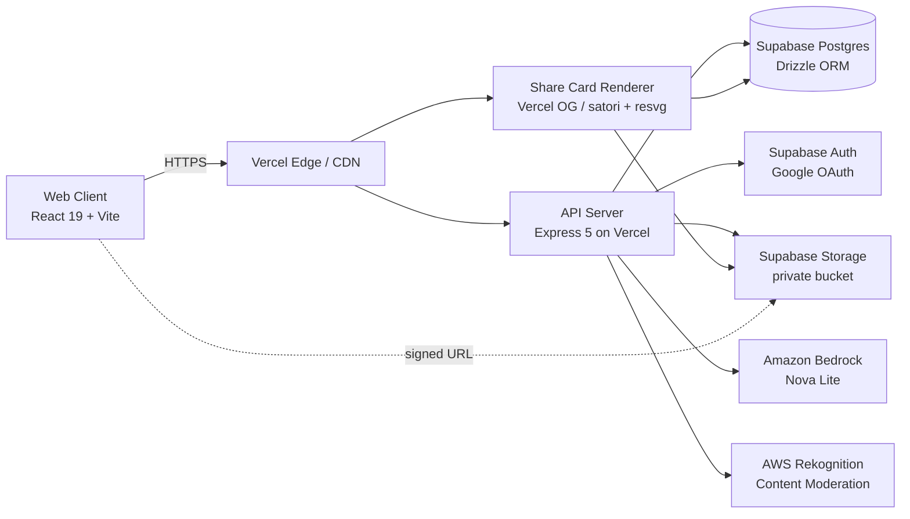
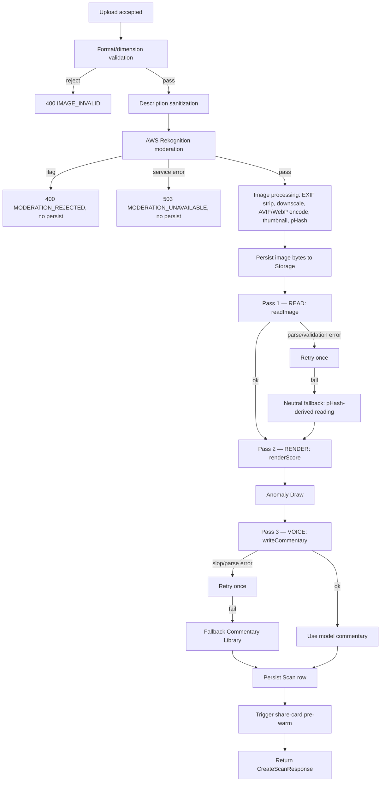
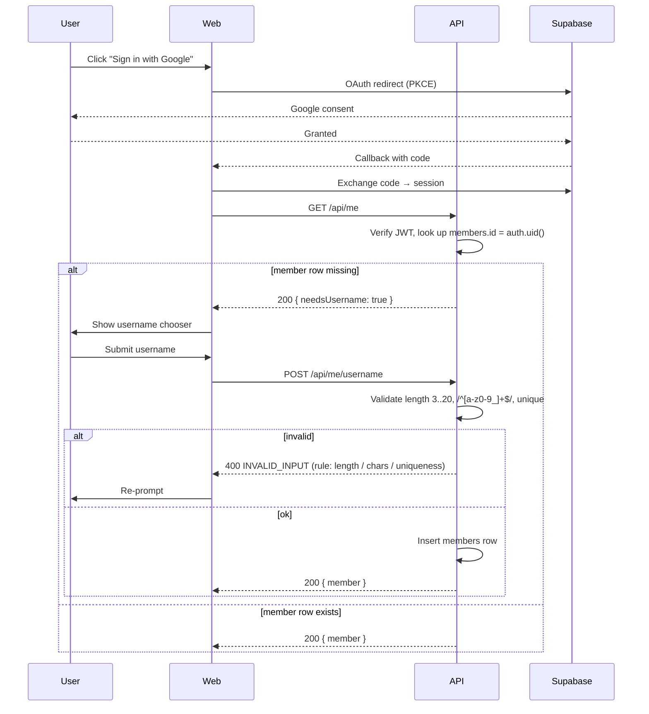

# Design Document

## Overview

POWERLVL is a single-loop social product: upload a photo, watch a 7–10 second cinematic reveal, get a deterministic Score (1,000–100,000), Tier, four Core Stats, five Category Stats, one line of dramatic commentary, and an occasional Anomaly. Results render to a server-rendered Share Card carrying a verification QR, are publicly permalinked at `/scan/{id}`, and rank on rolling Leaderboards.

The product priority is the reveal moment. Every architectural decision in this design is judged against three questions:

1. Does the user reach the slam phase in 7–10 seconds, every time, without spinners?
2. Does the same image and Category always produce the same Score?
3. Can a viewer scan the QR on a screenshot and see a verified permalink that proves the score is real?

The implementation is a pnpm monorepo with three production runtimes: a React 19 web client (Vite, Framer Motion, TailwindCSS), an Express 5 API (running on Vercel serverless functions backed by Vercel-managed Node), and Vercel OG share-card render functions. State of record is PostgreSQL via Supabase, with Supabase Auth for OAuth (Google), Supabase Storage for image bytes, and Supabase row-level security for read/write isolation. The Vision Model is Amazon Bedrock Nova Lite, and image moderation is AWS Rekognition. The OpenAPI spec at `lib/api-spec/openapi.yaml` is the contract source of truth; it generates the React Query hooks (`lib/api-client-react`) and Zod schemas (`lib/api-zod`).

## Architecture

### System Context



### Why this split

The Score and Anomaly assignment must be reproducible; isolating scoring as a pure library lets every transport (API, share-card, future migration tools, tests) recompute identical results from the same CulturalReading. Vision and moderation are isolated for the same reason: the orchestration layer treats them as replaceable adapters so that a faulty Bedrock response triggers fallback without leaking implementation detail into request handlers.

## Components and Interfaces

The system is built from a small set of libraries and runtime artifacts. Each library has a narrow surface and is consumed by name from the workspace `catalog`.

### Component Responsibilities

- **Web Client (`artifacts/web`)** — landing, scan setup, cinematic reveal, result, feed, leaderboards, profile, auth flow, share-card preview. Owns the reveal choreography and reduced-motion adaptation.
- **API Server (`artifacts/api-server`)** — request validation (Zod), rate limiting, file upload + moderation, image processing, Vision Model orchestration, slop detection, scoring, anomaly assignment, persistence, claim-on-signin, leaderboard queries, feed queries, like toggling.
- **Share Card Renderer (`artifacts/share-card`)** — Vercel OG functions per aspect ratio rendering deterministic SVG-to-PNG with embedded QR. Read-only against the database.
- **Database (`lib/db`)** — Drizzle schema, migrations via `drizzle-kit push`, Supabase RLS policies declared as SQL alongside schema.
- **API Spec (`lib/api-spec`)** — OpenAPI source of truth and Orval codegen.
- **Generated Clients (`lib/api-client-react`, `lib/api-zod`)** — never hand-edited; regenerated by `pnpm --filter @workspace/api-spec run codegen`.
- **Scoring Engine (`lib/scoring`)** — pure deterministic functions: renderScore, tier mapping, anomaly weighted draw with seeded RNG, and per-category stat derivation.
- **Vision Adapter (`lib/vision`)** — Bedrock Nova Lite client, structured-output prompts (Pass 1 & 3), retry policy, slop detector, fallback commentary library, and `analyzeImage` orchestrator.
- **Moderation Adapter (`lib/moderation`)** — Rekognition client.
- **Image Processor (`lib/images`)** — `sharp`-based pipeline for EXIF strip, downscale, AVIF/WebP encode, thumbnail, perceptual-hash.
- **Rate Limiter (`lib/ratelimit`)** — Postgres-backed token bucket shared across serverless instances.
- **Reveal Controller (`lib/reveal-controller`)** — pure phase sequencer driven by `performance.now()` and the API response promise.
- **Design Tokens (`lib/design-tokens`)** — colors, fonts, motion presets, icon set; consumed by both web and share-card renderers.
- **QR Renderer (`lib/qr`)** — deterministic SVG QR generator at error-correction level M.
- **Description Sanitizer (`lib/description-sanitizer`)** — profanity + prompt-injection filter.

### Interface Contracts

The package surfaces below are the only inter-package contracts. Implementations beneath them are private.

```ts
// lib/scoring/src/index.ts
export interface CulturalReading {
  imageSubjects: string[];                  // 1..6 lowercase singular nouns
  archetype: Archetype;                     // one of ~30 labels
  subjectClass: SubjectClass;               // one of 10 classes
  jokeTarget: JokeTarget;                   // one of 5 values
  memeticStatus: MemeticStatus;             // one of 5 values
  tasteDemonstrated: number;                // 0..100
  culturalRecognition: number;              // 0..100
  absurdity: number;                        // 0..10
  sincerity: number;                        // 0..10
  pretension: number;                       // 0..10
  menace: number;                           // 0..10
  wholesome: number;                        // 0..10
  powerlvlBrandVisible: boolean;
  tasteBrandsVisible: BrandSlug[];
  categoryMatchScore: number;               // 0..10
  sceneNotes: string;                       // 1..2 sentences, factual
}
export interface RenderedScore {
  score: number;
  tier: Tier;
  verdictNoun: string;
  coreStats: CoreStats;
  categoryStats: Record<string, number>;
  modifiersApplied: ModifierLog[];
  scorePreModifiers: number;
}
export function renderScore(reading: CulturalReading, scanId: string): RenderedScore
export function scoreToTier(score: number): Tier

// lib/scoring/src/anomaly.ts
export function deriveAnomalySeed(i: { scanId: string; category: Category; imagePerceptualHash: string }): number
export function drawAnomaly(seed: number): AnomalyType | null
export function applyAnomalyModifier(score: number, anomaly: AnomalyType | null, seed: number): { finalScore: number; modifierPct: number }

// lib/vision/src/index.ts
export interface VisionRequest {
  imageBytes: Buffer
  imageMediaType: 'image/jpeg' | 'image/png' | 'image/webp' | 'image/heic'
  category: Category
  description: string | null
  perceptualHash: string
}
export async function readImage(req: VisionRequest): Promise<CulturalReading>

export interface CommentaryRequest {
  reading: CulturalReading
  score: number
  tier: Tier
  verdictNoun: string
  category: Category
  description: string | null
}
export async function writeCommentary(req: CommentaryRequest): Promise<string>

export interface AnalyzeImageResult {
  culturalReading: CulturalReading
  rendered: RenderedScore
  commentary: string
  commentarySource: 'model' | 'fallback'
  anomaly: { anomalyType: AnomalyType; modifierPct: number } | null
  forcedAnomaly: AnomalyType | null
  pass1LatencyMs: number | null
  pass3LatencyMs: number | null
  pass1Retried: boolean
  pass3Retried: boolean
}
export async function analyzeImage(req: VisionRequest): Promise<AnalyzeImageResult>

// lib/moderation/src/index.ts
export interface ModerationVerdict { ok: boolean; flaggedLabels: string[] }
export function moderate(imageBytes: Buffer): Promise<ModerationVerdict>     // throws on service error

// lib/images/src/index.ts
export interface ProcessedImage { processed: Buffer; thumbnail: Buffer; perceptualHash: string; format: 'avif' | 'webp'; width: number; height: number }
export function processImage(input: { bytes: Buffer; declaredMime: string }): Promise<ProcessedImage>     // throws on validation failure with code

// lib/ratelimit/src/index.ts
export interface ConsumeResult { ok: boolean; retryAfterSec: number; remaining: number }
export function consume(bucketKey: string, capacity: number, refillPerSec: number): Promise<ConsumeResult>

// lib/reveal-controller/src/index.ts
export type RevealPhase = 'lockOn' | 'scanSweep' | 'analysis' | 'slam' | 'reveal' | 'done'
export interface RevealController {
  start(opts: { submittedAt: number; responsePromise: Promise<CreateScanResponse>; onPhase: (phase: RevealPhase, ctx: RevealContext) => void; reducedMotion: boolean }): { cancel: () => void }
}

// lib/qr/src/index.ts
export function renderQrSvg(text: string, opts?: { size?: number; quietZoneModules?: number }): string

// lib/description-sanitizer/src/index.ts
export interface SanitizationResult { sanitized: string | null; profanityStripped: boolean; injectionStripped: boolean }
export function sanitizeDescription(input: string): SanitizationResult
```

## Repository Layout

```
powermy1234/
├── artifacts/
│   ├── api-server/          # Express 5 (existing) — extended with scan, leaderboard, feed, profile, auth routes
│   ├── web/                 # NEW: React 19 + Vite client
│   └── share-card/          # NEW: Vercel OG render functions (story / square / landscape)
├── lib/
│   ├── api-spec/            # OpenAPI source of truth (existing) — extended for new endpoints
│   ├── api-client-react/    # Orval-generated React Query hooks (existing, regenerated)
│   ├── api-zod/             # Orval-generated Zod schemas (existing, regenerated)
│   ├── db/                  # Drizzle schema + migrations (existing skeleton — populated)
│   ├── scoring/             # NEW: deterministic scoring + anomaly engine (pure)
│   ├── vision/              # NEW: Bedrock Nova Lite adapter + slop detector + fallback library
│   ├── moderation/          # NEW: AWS Rekognition adapter
│   ├── images/              # NEW: image processing (sharp): EXIF strip, downscale, AVIF/WebP encode, thumbnail
│   ├── ratelimit/           # NEW: token-bucket rate limiter (Postgres-backed)
│   ├── design-tokens/       # NEW: theme tokens (colors, fonts, spacing, motion presets) shared across web + share-card
│   └── qr/                  # NEW: QR code SVG generator for verification
└── scripts/                 # Existing — extended with seed/test fixtures
```

All new packages follow the existing convention: `@workspace/{name}`, `type: module`, exports map per the workspace skill, dependencies declared via the `catalog:` reference where pinned in `pnpm-workspace.yaml`.


## Data Models

All tables live in `lib/db/src/schema/`, one file per table, re-exported through `lib/db/src/schema/index.ts`. IDs are `uuid` generated server-side (`crypto.randomUUID()`) so Scan IDs are unguessable in permalinks. Timestamps are `timestamptz` with default `now()`. RLS is enabled on every table that holds Member-owned data.

### Tables

#### `members`

Member account. Created on first OAuth sign-in.

| Column           | Type          | Notes |
|------------------|---------------|-------|
| `id`             | uuid PK       | Matches Supabase `auth.users.id` |
| `username`       | text unique   | 3–20 chars, `[a-z0-9_]`, immutable after first save |
| `created_at`     | timestamptz   | |
| `deleted_at`     | timestamptz null | Soft-delete marker; account-deletion job purges rows |

Indexes: `unique(username)`, `unique(lower(username))` to enforce case-insensitive uniqueness.

#### `scans`

Single Scan record. Created at the start of the scanner pipeline; mutated only to fill in derived fields (score, tier, anomaly, commentary, member ownership on claim).

| Column                  | Type           | Notes |
|-------------------------|----------------|-------|
| `id`                    | uuid PK        | Surfaced as `/scan/{id}` |
| `member_id`             | uuid null FK   | Null for unclaimed Anonymous Scans |
| `anon_session_id`       | uuid null      | Browser-bound session identifier (cookie); used for soft-auth claim |
| `category`              | enum           | SETUPS / FITNESS / DRIP / PETS / RIDES / WILDCARD |
| `description`           | text null      | Sanitized; ≤ 120 chars |
| `score`                 | integer        | 1000–100000, CHECK constraint |
| `tier`                  | enum           | D / C / B / A / S / SS / SSS / LIMITLESS, CHECK derived from score |
| `core_stats`            | jsonb          | `{aura, power, status, threat}` each 0–10000 |
| `category_stats`        | jsonb          | `{stat1..stat5}` each 0–10000, keyed by Category |
| `commentary`            | text           | 8–14 word commentary line (final, after slop detector / fallback) |
| `commentary_source`     | enum           | `model` or `fallback` |
| `anomaly_type`          | enum null      | POWER_SURGE / FORBIDDEN_AURA / SCOUTER_FAILURE / UNREGISTERED_ENERGY / CHAOS_SPIKE |
| `anomaly_modifier_pct`  | numeric(4,2) null | Applied modifier (-15.00 to +15.00) — for audit |
| `score_pre_anomaly`     | integer        | Score before anomaly modifier — needed for property-test invariants |
| `image_object_key`      | text           | Supabase Storage key for processed image |
| `thumbnail_object_key`  | text           | Supabase Storage key for 480px thumbnail |
| `image_perceptual_hash` | text           | pHash; used for deterministic neutral fallback |
| `model_response`        | jsonb null     | Raw structured Vision Model output (for debugging) |
| `created_at`            | timestamptz    | |
| `expires_at`            | timestamptz null | Set on Anonymous Scans (`created_at + 30 days`) |
| `expired_at`            | timestamptz null | Set when image purge job has run |

Indexes:
- `(score DESC, created_at ASC)` for leaderboard tiebreaks
- `(category, score DESC, created_at ASC)` for per-category leaderboards
- `(created_at DESC)` for feed
- `(member_id, created_at DESC)` for profile history
- `(anon_session_id, created_at DESC)` for daily-limit checks on anonymous users
- `(expires_at)` partial index where `expires_at IS NOT NULL AND expired_at IS NULL` for the purge job

Constraints:
- `CHECK (score BETWEEN 1000 AND 100000)`
- `CHECK ((member_id IS NULL) <> (anon_session_id IS NULL OR member_id IS NOT NULL))` — every Scan belongs to either a Member or an anon session
- `CHECK (tier = derive_tier(score))` — Postgres function enforces tier matches score band

#### `likes`

Per-visitor like state on Feed entries. Anonymous likes keyed by `anon_session_id`; Member likes keyed by `member_id`. Toggle-style: row exists ⇒ liked.

| Column            | Type        | Notes |
|-------------------|-------------|-------|
| `scan_id`         | uuid FK     | |
| `member_id`       | uuid null   | One of `member_id` or `anon_session_id` is non-null |
| `anon_session_id` | uuid null   | |
| `created_at`      | timestamptz | |

Primary key: `(scan_id, COALESCE(member_id::text, anon_session_id::text))` enforced via partial unique indexes on `(scan_id, member_id)` and `(scan_id, anon_session_id)`.

#### `rate_limit_buckets`

Token-bucket-style accounting for per-IP and per-Member Scan limits and per-IP Share-Card render limits. Postgres-backed so serverless function instances share state.

| Column        | Type        | Notes |
|---------------|-------------|-------|
| `bucket_key`  | text PK     | e.g. `scan:ip:1.2.3.4`, `scan:member:{uuid}`, `share:ip:1.2.3.4` |
| `tokens`      | integer     | |
| `refilled_at` | timestamptz | Last refill time |
| `window`      | enum        | `hour` (Scan limits) or `second` (Share-Card limit, evaluated as 5/sec via 5000 ms window) |

#### `daily_scan_counts`

Per-Member daily counter, used to enforce the 25/day Member limit and to display "time remaining until reset". Anonymous daily limit (1/day) is computed by querying `scans.anon_session_id` against the local-time-zone day boundary submitted by the client.

| Column     | Type   | Notes |
|------------|--------|-------|
| `member_id`| uuid PK part | |
| `utc_day`  | date PK part | |
| `count`    | integer | |

#### `anon_sessions`

Tracks browser-bound anonymous identities. Created on first visit via cookie + fingerprint. Used for daily-limit enforcement and soft-auth claim.

| Column           | Type        | Notes |
|------------------|-------------|-------|
| `id`             | uuid PK     | |
| `fingerprint`    | text        | Hash of stable browser signals (no IP) |
| `cookie_set_at`  | timestamptz | |
| `local_tz`       | text null   | IANA tz reported by client at session creation |
| `last_seen_at`   | timestamptz | |

Index: `(fingerprint)` for fast lookup.

### Row-Level Security

RLS is enabled on `members`, `scans`, `likes`, `daily_scan_counts`, `anon_sessions`. The API server uses two Postgres roles:

- **`anon`** — public role used for unauthenticated requests through Supabase. Read-only access to projection views only.
- **`service`** — service-role key, used only by the API server to write rows after server-side validation.

RLS policies (declared as SQL alongside the schema):

- `members`: SELECT allowed to `anon` for `username, created_at`. UPDATE allowed to authenticated user where `id = auth.uid()`.
- `scans`: SELECT for full row only when `auth.uid() = scans.member_id`. The public Feed, Leaderboard, and Permalink views read from `scans_public_v` (a security-definer view restricted to safe columns: `id, member_id (joined to username), category, score, tier, anomaly_type, commentary, description, thumbnail_object_key, created_at`).
- `likes`: SELECT/INSERT/DELETE allowed when `member_id = auth.uid()` OR `anon_session_id = current_setting('app.anon_session_id')::uuid`.
- `daily_scan_counts`: SELECT/UPDATE allowed when `member_id = auth.uid()`.

The API server never queries Postgres with the user's JWT; it validates the JWT itself, sets `app.anon_session_id` from the cookie, and uses the service role for writes. RLS is the second layer of defense — the primary defense is server-side authorization in the route handlers.


## API Surface

The OpenAPI spec at `lib/api-spec/openapi.yaml` is extended with the endpoints below. All paths are prefixed `/api`. All request and response bodies are validated through generated Zod schemas (`lib/api-zod`); request handlers reject any payload failing validation with `400 INVALID_INPUT`.

### Authentication

Sessions are managed by Supabase Auth. The web client holds a Supabase session (httpOnly cookie via `@supabase/ssr`-style integration). For API requests, the server reads the `sb-access-token` cookie and verifies the JWT with the Supabase JWKS. Anonymous identity is carried in a separate first-party cookie `plvl_anon` containing the `anon_session_id`.

### Endpoint Catalog

| Method | Path                              | Auth                     | Purpose |
|--------|-----------------------------------|--------------------------|---------|
| POST   | `/api/anon/session`               | none                     | Create or refresh the anonymous session cookie; returns the session id and current daily-quota state |
| POST   | `/api/scans`                      | optional (anon or member)| Create a Scan: multipart upload of image + Category + optional description; runs the full pipeline server-side; returns the persisted Scan |
| GET    | `/api/scans/{id}`                 | none                     | Fetch a Scan by id (public projection); used by permalink page and Feed entry detail |
| GET    | `/api/scans/{id}/share-card.png`  | none                     | Render share card (delegates to `artifacts/share-card`); query `?ratio=story\|square\|landscape` |
| POST   | `/api/scans/{id}/claim`           | member                   | Claim an unclaimed Scan during soft-auth; verifies the caller's `anon_session_id` matches the Scan's |
| GET    | `/api/feed`                       | none                     | Paged Feed; query `?cursor={iso}&limit=20`; returns 20 entries (public projection) plus next-cursor |
| POST   | `/api/scans/{id}/like`            | optional                 | Toggle like for the calling visitor; returns new liked-state and like count |
| GET    | `/api/leaderboards`               | none                     | Query a Leaderboard; required query: `window=today\|week\|all`, `scope=global\|setups\|fitness\|drip\|pets\|rides\|wildcard`; returns up to 100 entries |
| GET    | `/api/profiles/{username}`        | none                     | Public Profile: header (username, avatar initials, aggregates) + first page of scan history |
| GET    | `/api/profiles/{username}/scans`  | none                     | Profile scan history page; query `?cursor={iso}&limit=20` |
| GET    | `/api/me`                         | member                   | Current Member, daily-quota state, claim-eligible anonymous scans |
| POST   | `/api/me/username`                | member (no username yet) | Set the username on first sign-in |
| DELETE | `/api/me`                         | member                   | Account deletion (purges scans + images) |
| GET    | `/api/healthz`                    | none                     | Existing health check |

### Selected Schemas

The full OpenAPI definitions live in `lib/api-spec/openapi.yaml`. The shapes below are the canonical contract that flows through the generated Zod schemas and React Query hooks.

```ts
// Category
type Category = 'SETUPS' | 'FITNESS' | 'DRIP' | 'PETS' | 'RIDES' | 'WILDCARD'

// Tier
type Tier = 'D' | 'C' | 'B' | 'A' | 'S' | 'SS' | 'SSS' | 'LIMITLESS'

// Anomaly
type AnomalyType =
  | 'POWER_SURGE_DETECTED'
  | 'FORBIDDEN_AURA'
  | 'SCOUTER_FAILURE'
  | 'UNREGISTERED_ENERGY'
  | 'CHAOS_SPIKE'

// Scan (public projection — what the Feed, Leaderboard, Permalink see)
interface ScanPublic {
  id: string
  username: string | null            // null when unclaimed anonymous
  category: Category
  score: number                       // integer 1000..100000
  tier: Tier
  coreStats: { aura: number; power: number; status: number; threat: number }
  categoryStats: Record<string, number>   // five keys, depend on category
  commentary: string                  // 8..14 words
  description: string | null
  anomaly: AnomalyType | null
  imageUrl: string                    // signed URL, ≤ 24h
  thumbnailUrl: string                // signed URL, ≤ 24h
  createdAt: string                   // ISO 8601
  permalink: string                   // absolute URL
  shareCardUrls: { story: string; square: string; landscape: string }
  likeCount: number
  likedByMe: boolean
}

// Create Scan request (multipart)
//   field "image": file
//   field "category": Category
//   field "description": string (≤ 120 chars, optional)
//   field "localDate": yyyy-mm-dd (visitor's local date, for anonymous daily-limit)
//   field "localTz": IANA tz string (optional, refines anonymous daily window)

// Create Scan response: ScanPublic + reveal sync hints
interface CreateScanResponse {
  scan: ScanPublic
  reveal: {
    /** ms elapsed in the pipeline before this response was emitted */
    serverElapsedMs: number
    /** anomaly-driven reveal variant the client must play */
    revealVariant:
      | 'standard'
      | 'power_surge'
      | 'forbidden_aura'
      | 'scouter_failure'
      | 'unregistered_energy'
      | 'chaos_spike'
  }
}

// Leaderboard
interface LeaderboardEntry {
  rank: number                        // 1..100
  scanId: string
  username: string
  category: Category
  score: number
  tier: Tier
  anomaly: AnomalyType | null
  createdAt: string
  permalink: string
}

interface LeaderboardResponse {
  window: 'today' | 'week' | 'all'
  scope: Category | 'GLOBAL'
  entries: LeaderboardEntry[]         // up to 100
  computedAt: string
}

// Errors — discriminated by `code`
type ApiError =
  | { code: 'INVALID_INPUT'; message: string; field?: string }
  | { code: 'UNAUTHENTICATED'; message: string }
  | { code: 'FORBIDDEN'; message: string }
  | { code: 'NOT_FOUND'; message: string }
  | { code: 'RATE_LIMITED'; message: string; retryAfterSec: number }
  | { code: 'DAILY_LIMIT_REACHED'; message: string; resetAt: string }
  | { code: 'MODERATION_REJECTED'; message: string; categories: string[] }
  | { code: 'MODERATION_UNAVAILABLE'; message: string }
  | { code: 'IMAGE_INVALID'; message: string; reason: 'size' | 'format' | 'dimensions' | 'mime_mismatch' }
  | { code: 'VISION_UNAVAILABLE'; message: string }   // surfaces SCOUTER_FAILURE upstream
  | { code: 'INTERNAL'; message: string }
```

### Idempotency

`POST /api/scans` is **not** idempotent across separate requests (each upload yields a new Scan). However the pipeline is internally idempotent against retries: every Scan is computed under a stable seed `seed = sha256(member_id || anon_session_id || image_perceptual_hash || category)`. A retried request with the same image and same caller produces the same final Score, Tier, and stats — though the Scan ID is new and the anomaly draw uses the new request's nonce.

`POST /api/scans/{id}/claim` is idempotent: claiming an already-claimed-by-you Scan is a no-op `200`; claiming a Scan owned by another member is `403`.

### Rate Limits

Enforced before any expensive work runs. Returns `429 RATE_LIMITED` with `retryAfterSec`.

| Bucket                       | Limit              | Source                    |
|------------------------------|--------------------|---------------------------|
| `scan:ip:{ip}`               | 10 / hour          | Requirement 14.1          |
| `scan:member:{member_id}`    | 30 / hour          | Requirement 14.1          |
| `share:ip:{ip}`              | 5 / second         | Requirement 14.2          |
| Anonymous daily              | 1 / local-day      | Requirement 1.2 / 1.3     |
| Member daily                 | 25 / UTC-day       | Requirement 9.4 / 9.5     |

The IP and Member buckets use the `rate_limit_buckets` table with a token-bucket refill formula computed at read time. The daily limits use `daily_scan_counts` (Member) and a count over `scans.anon_session_id` filtered by the visitor-supplied `localDate` (Anonymous).


## Scanner Pipeline

> **PARTIALLY UPDATED for the Dual-Pass Engine.** Steps 1–5 (upload, validation, sanitization, moderation, image processing, storage write) and steps 13–15 (persistence, share-card pre-warm, response) are unchanged. Steps 6–12 (Vision call, retry, slop, fallback, neutral fallback, scoring, anomaly draw) are **replaced** by the Dual-Pass Cultural Scoring Engine. Read the Dual-Pass section for the canonical AI/scoring path. Anchor: `## Dual-Pass Cultural Scoring Engine`.

The end-to-end pipeline runs server-side inside the `POST /api/scans` handler. Every step has a budget and a defined fallback. The reveal animation on the client is choreographed against the server response, with a hard 7–10 second total budget.

### Pipeline Stages



### Per-Stage Detail

**1. Upload + format/dimension validation.** Multipart parsed via `busboy`. Server reads the first 16 bytes for magic-number sniffing and decodes a probe via `sharp().metadata()` to confirm format and dimensions. Rejects:
- Size > 8 MB
- Shorter edge < 256 px
- Format ∉ {JPEG, PNG, HEIC, WebP}
- Declared MIME ≠ decoded MIME

**2. Description sanitization.** Two-stage: a profanity filter (deny-list with leet-mapping) and a prompt-injection filter (looks for instruction-style patterns: `ignore previous`, `you are now`, `system:`, role tokens, common jailbreak markers, control characters). Flagged content is stripped; if stripping yields a non-empty result, the sanitized version is used; if the entire input was flagged, the description is dropped (Scan proceeds without one).

**3. Moderation.** AWS Rekognition `DetectModerationLabels` against image bytes. If any returned label has confidence ≥ 70 and falls under {Explicit Nudity, Violence, Hate Symbols}, reject with the labels listed in the error. If the call errors or times out (3 s budget), reject with `MODERATION_UNAVAILABLE` and persist nothing.

**4. Image processing.** Single `sharp` pipeline:
- Strip metadata (`.withMetadata({ exif: {} })` then `.rotate()` to bake orientation, then strip)
- Downscale so longer edge ≤ 1600 px (`fit: inside`)
- Encode AVIF first; if encoded size > 300 KB, fall back to WebP at decreasing quality until ≤ 300 KB
- Generate 480 px long-edge thumbnail (WebP, quality target 70)
- Compute perceptual hash (`pHash` via `sharp` greyscale + 8×8 DCT) — used as the deterministic neutral-fallback seed

**5. Storage write.** Both processed image and thumbnail uploaded to Supabase Storage private bucket with opaque keys: `scans/{yyyy}/{mm}/{scanId}.{ext}` and `scans/{yyyy}/{mm}/{scanId}.thumb.webp`. Storage write happens before the Vision Model call so that retries do not re-upload.

**6. Pass 1 — READ (readImage).** Amazon Bedrock Nova Lite call via the AWS SDK. Sends processed image, Category, and sanitized description. Enforces structured JSON output schema (`CulturalReading`). Uses `temperature=0`, `top_p=0.1` and a 4 s timeout.
The model returns semantic 0–100 signals and a category match score. It does NOT emit a score, tier, stats, or commentary.

**7. Retry & Fallback policy (Pass 1).** If the JSON response is invalid, required fields are missing, or levels/scores are out of range, clamp minor bounds. If key structural elements are missing, retry once. If the retry fails, synthesize a deterministic neutral `CulturalReading` (subjectClass='mid', tasteDemonstrated=50, culturalRecognition=50), force `forcedAnomaly = SCOUTER_FAILURE`, and continue.

**8. Pass 2 — RENDER (renderScore).** A pure TypeScript function converting `CulturalReading` to `RenderedScore` deterministically. Applies the 11 cultural-fairness modifiers in the exact fixed order (floor/ceiling/cap/pull). Derives stats using the ease-in mapping and selects a verdict noun via Mulberry32 seeded with `(scanId, tier, flavor)`.

**9. Anomaly Draw.** Anomaly engine runs next. Seeds Mulberry32 using `sha256(scanId + category + pHash)`. Draws an anomaly type and applies its score modifier (POWER_SURGE +5-10%, FORBIDDEN_AURA -5-10%, CHAOS_SPIKE -15-+15%). Clamps score to `[1000, 100000]` and sets client `revealVariant`.

**10. Pass 3 — VOICE (writeCommentary).** Amazon Bedrock Nova Lite call. Receives `CulturalReading`, final score, tier, verdict noun, category, and description. Outputs a single commentary line JSON `{ "commentary": string }`. Uses `temperature=0`, `top_p=0.1` and a 2 s timeout.

**11. Retry & Fallback policy (Pass 3).** If Pass 3 fails to parse, or the commentary is rejected by the slop detector (word count, banned words, or not grounded in image subjects), retry once. If retry fails, draw a commentary template from the Fallback Commentary Library matching `(category, tier)` and replace the `{noun}` placeholder with a subject noun.

**12. Persistence.** Single Drizzle insert into `scans`. Saves processed metadata, `cultural_reading` JSONB, `verdict_noun` text, `modifiers_applied` JSONB, final `score`, pre-anomaly score, `tier`, and `anomaly_type`.

**13. Share-card pre-warm.** After the row commits, the API server fires three fire-and-forget HTTPS requests against the share-card render functions for each ratio. The renderer caches by `scan_id + ratio`. This pre-warm is best-effort; the share card is regenerated on demand if the cache is cold.

**14. Response.** `CreateScanResponse` is sent to the client with the persisted Scan and the `revealVariant` hint.

### Reveal Sync (Client ↔ Server Timing)

The 7–10 second reveal is choreographed by the client; the server's job is to deliver `CreateScanResponse` in time. The client begins the reveal sequence the moment the user submits, in parallel with the request:

```
t = 0.0s  Submit pressed → client begins lock-on phase locally
          Request fires to /api/scans
t = 0.0–1.5s  Lock-on phase (HUD frames assemble around image)
t = 1.5–4.5s  Scan sweep phase (vertical sweep across image; HUD telemetry text streams)
t = 4.5–6.5s  Analysis phase (compact pulses; "ANALYSIS" label)
t = 6.5s   Choreographed slam moment
          IF response received: trigger slam phase with the score
          IF NOT received: continue analysis phase up to t = 10.5s additional buffer
                           then: scouter-failure reveal variant + 503 path triggers neutral fallback
t = 6.5–7.0s  Slam phase (score lands, white flash 80ms, score pinned)
t = 7.0–9.5s  Sequential reveal: tier badge → core stats → category stats → commentary
t = 9.5–10.0s  Result idle; soft-auth prompt fades in for anonymous users
```

The client schedules the slam to fire on `requestAnimationFrame`-aligned ticks tracked from `submit_pressed_at`. If the response arrives before `t = 6.5s`, the client buffers it and waits; if after, the analysis phase loops a "deep scan" sub-animation until `t = 10.0s` max. Beyond that, the client treats the request as failed and plays the `scouter_failure` variant against a deterministic neutral payload it computes locally from a stub (this matches Requirement 4.5).

The server enforces its own end-to-end budget of **6.0 seconds** for the work that must complete before the client can reach the slam moment without animation extension. The 6.0 s budget is split: 0.5 s upload parsing, 1.0 s moderation + image processing in parallel, 4.0 s Vision Model (with 1 retry budgeted into the parallel envelope by emitting the retry only if there is ≥ 1.5 s left), 0.5 s scoring + persistence. If Bedrock crosses the 4.0 s budget, the orchestrator aborts the in-flight call and goes to neutral fallback so the response still lands by ~6.0 s.

## Error Handling

The system surfaces errors with a uniform discriminated-union response (`ApiError`, defined in the API Surface section). Each pipeline failure mode maps to one of those codes; clients render copy keyed off `code`, never off `message`.

### Failure Mode Matrix

| Failure                         | User-Visible Behavior                                  | Persisted? |
|---------------------------------|--------------------------------------------------------|-----------|
| Format / size / mime mismatch   | `IMAGE_INVALID` toast on setup screen                  | No        |
| Moderation flag                 | `MODERATION_REJECTED` notice with category labels      | No        |
| Moderation unavailable          | `MODERATION_UNAVAILABLE` notice; user can retry        | No        |
| Vision parse error (1st)        | Retry transparently                                    | —         |
| Vision parse error (retried)    | Neutral fallback + SCOUTER_FAILURE reveal variant      | Yes       |
| Vision timeout                  | Aborted; same as above                                 | Yes       |
| Slop detector reject            | Fallback commentary; `commentary_source='fallback'`    | Yes       |
| Storage write error             | `INTERNAL`; image not persisted; cleanup row reconciled | No        |
| Persistence error               | `INTERNAL`; image cleaned up by background reconciler  | No        |
| Share-card pre-warm error       | None (silent); on-demand render still works            | Yes       |
| Rate-limit hit                  | `RATE_LIMI## Deterministic Scoring, Tiers, Stats, and Verdict Nouns (Pass 2)

Scoring lives entirely in `lib/scoring`, exposed as pure functions. No I/O, no clocks, no randomness except what is sourced from explicit seeds. The same inputs always produce the same outputs.

### Inputs

The scoring engine's input is a `CulturalReading` — the structured output of Pass 1 (Read). It contains semantic 0–100 signals, not numeric 1–10 trait confidences.

```ts
// lib/scoring/src/types.ts
interface CulturalReading {
  imageSubjects: string[];                  // 1..6 lowercase singular nouns
  archetype: Archetype;                     // one of ~30 labels
  subjectClass: SubjectClass;               // one of 10 classes
  jokeTarget: JokeTarget;                   // one of 5 values
  memeticStatus: MemeticStatus;             // one of 5 values
  tasteDemonstrated: number;                // 0..100
  culturalRecognition: number;              // 0..100
  absurdity: number;                        // 0..10
  sincerity: number;                        // 0..10
  pretension: number;                       // 0..10
  menace: number;                           // 0..10
  wholesome: number;                        // 0..10
  powerlvlBrandVisible: boolean;
  tasteBrandsVisible: BrandSlug[];
  categoryMatchScore: number;               // 0..10
  sceneNotes: string;                       // 1..2 sentences, factual
}
```

### Score Derivation (renderScore)

`lib/scoring` exposes `renderScore(reading: CulturalReading, scanId: string): RenderedScore`. The full algorithm is specified in `nova-lite-system-prompt.md` Blocks K–L. Summary:

1. **Base Score**:
   ```ts
   function computeBaseScore(reading: CulturalReading): number {
     const blended = 0.65 * reading.tasteDemonstrated + 0.35 * reading.culturalRecognition;
     const normalized = blended / 100;
     const eased = Math.pow(normalized, 1.45); // ease-in curve
     return Math.round(1000 + eased * 99000);   // 1000..100000
   }
   ```
2. **Modifier Engine**: Applies floors/ceilings/caps in the exact fixed order (11 modifiers) to enforce cultural-fairness invariants.
3. **Tier Derivation**: Converts the score to a Tier badge (D through LIMITLESS).
4. **LIMITLESS Gate**: Enforces that a score ≥ 99,000 requires `subjectClass` ∈ `{iconic, iconic_meme}` AND `culturalRecognition` ≥ 95. If not met, score is capped at 98,999 (SSS-tier).
5. **Stats Derivation**: Maps cultural signals onto 4 core stats and 5 category-specific stats using a mild ease-in curve (`pow(norm, 1.3) * 10000`).
6. **Verdict Noun Selection**: Deterministically selects a verdict noun from the curated pool matching the rendered tier.

The `RenderedScore` output:

```ts
interface RenderedScore {
  score: number;                    // integer 1000..100000
  tier: Tier;                       // D | C | B | A | S | SS | SSS | LIMITLESS
  verdictNoun: string;              // from the curated pool
  coreStats: CoreStats;             // 4 stats, each 0..10000
  categoryStats: Record<string, number>;  // 5 stats, each 0..10000
  modifiersApplied: ModifierLog[];  // audit trail
  scorePreModifiers: number;        // baseScore before floors/ceilings
}

interface ModifierLog {
  name: string;
  condition: string;
  action: 'floor' | 'ceiling' | 'pull' | 'bonus' | 'penalty';
  scoreBefore: number;
  scoreAfter: number;
}
```

### Cultural-Fairness Modifier Engine

The modifier engine is the product's cultural opinion codified as deterministic code. It runs 11 modifiers in a fixed, non-negotiable order:

1. **Anti-iconic ceiling** — `subjectClass == "anti_iconic"` → `score = min(score, 4999)` (D-tier cap)
2. **Satirical-inversion floor** — `subjectClass == "satirical_inversion" AND jokeTarget == "the_powerful"` → `score = max(score, 55000)` (S-tier floor)
3. **Reverence-protected floor** — `subjectClass ∈ ("reverence_protected", "sacred_or_memorial", "first_attempt_earnest")` → `score = max(score, 15000)` (B-tier floor)
4. **Iconic floor** — `subjectClass == "iconic"` → `score = max(score, 55000)` (S-tier floor)
5. **Iconic-meme floor** — `subjectClass == "iconic" AND memeticStatus ∈ ("iconic_template", "fresh_meme")` → `score = max(score, 75000)` (SS-tier floor)
6. **POWERLVL Brand Pull + Cap** — `powerlvlBrandVisible == true` → pull 30% toward S-midpoint (62,500), cap at S-ceiling (74,999)
7. **Taste-brand bonus + cap** — `tasteBrandsVisible.length >= 1 AND subjectClass ∈ ("mid", "trying_too_hard")` → add 1500 per brand, cap at A-ceiling (54,999)
8. **Pretension Penalty** — `pretension >= 70 AND subjectClass ∈ ("trying_too_hard", "mid")` → cap at C-ceiling + 5,000 (19,999)
9. **Self-aware affection** — `jokeTarget == "self_aware"` → floor at B (15,000), cap at S-ceiling (74,999)
10. **Out-of-scope cap** — `categoryMatchScore <= 2` → cap at C-ceiling (14,999)
11. **Final Clamp** — clamp final score to `[1000, 100000]`

These invariants are property-tested (Fast-Check properties P-R1 through P-R19) and anchor-tested against 17 canonical images (Anchors A-1 through A-17).

### Per-Category Stats

Stat names per category are:
- **SETUPS**: Processing Power, Lock-In Rate, Build Quality, Threat Output, RGB Stability
- **FITNESS**: Power Output, Discipline Index, Stamina Core, Aura Level, Threat Rating
- **DRIP**: Rizz Level, Style Sync, Flex Value, Trend Energy, Aura Output
- **PETS**: Menace Level, Chaos Index, Divine Energy, Brain Activity, Aura Output
- **RIDES**: Horsepower Aura, Dominance Output, Street Presence, Threat Level, Engine Energy
- **WILDCARD**: Mystery Factor, Aura Output, Chaos Index, Rarity Score, Energy Signature

Stat derivation formula:
```ts
function signalToStat(value: number, scale: number = 100): number {
  const norm = value / scale;
  const eased = Math.pow(norm, 1.3);
  return Math.round(eased * 10000);
}
```
Core stats are derived using blends of cultural signals (e.g. `AURA = signalToStat(0.5 * tasteDemonstrated + 0.3 * wholesome*10 + 0.2 * sincerity*10)`).

### Verdict Noun

The verdict noun is a dramatic 1-2 word descriptor that appears alongside Score and Tier on the Result Screen and Share Cards. Selection is deterministic:
```ts
function pickVerdictNoun(tier: Tier, reading: CulturalReading, scanId: string): string {
  const flavor = dominantFlavor(reading);
  const pool = VERDICT_NOUNS[tier][flavor] ?? VERDICT_NOUNS[tier].default;
  const seed = sha256(`${scanId}|${tier}|${flavor}`);
  const idx = mulberry32(parseInt(seed.slice(0, 8), 16))() * pool.length | 0;
  return pool[idx];
}
```
Flavors include `menace`, `absurdity`, `wholesome`, `pretension`, `meme`, `iconic`, and `default`.

### Tier Mapping

Pure lookup, monotonic in score:
```ts
function scoreToTier(score: number): Tier {
  if (score <= 4999)  return 'D'
  if (score <= 14999) return 'C'
  if (score <= 34999) return 'B'
  if (score <= 54999) return 'A'
  if (score <= 74999) return 'S'
  if (score <= 89999) return 'SS'
  if (score <= 98999) return 'SSS'
  return 'LIMITLESS'
}
```

### Determinism Boundary

Pass 2 (`renderScore`) is the **mathematically guaranteed** determinism boundary. The same `CulturalReading + scanId` → the same `RenderedScore`, every time. Pass 1 and Pass 3 are deterministic *in practice* (temperature=0) but not formally guaranteed across Bedrock retries. The property tests cover Pass 2 only.


## Anomaly Engine

The anomaly engine is pure, seeded by a per-Scan nonce:
```ts
function deriveAnomalySeed(input: {
  scanId: string
  category: Category
  imagePerceptualHash: string
}): number {
  const h = sha256(`${input.scanId}|${input.category}|${input.imagePerceptualHash}`)
  return parseInt(h.slice(0, 8), 16)
}
```

### Distribution

Target: 6–8% of scans receive an anomaly. Visual-only anomalies must outweigh score-modifier anomalies.
- **POWER_SURGE_DETECTED** (0.85%) — score modifier (+5..+10%)
- **FORBIDDEN_AURA** (0.70%) — score modifier (-5..-10%)
- **CHAOS_SPIKE** (0.45%) — score modifier (-15..+15%)
- **SCOUTER_FAILURE** (2.70%) — visual-only (garbled score)
- **UNREGISTERED_ENERGY** (2.30%) — visual-only ("???" pre-reveal)
Total anomaly probability: 7.0%.

### Score Modifiers

Applied to the post-Pass 2 score before Pass 3 commentary is written:
```ts
function applyAnomalyModifier(score: number, anomaly: AnomalyType | null, seed: number): {
  finalScore: number
  modifierPct: number
}
```
If an anomaly modifies the score, the final score is clamped to `[1000, 100000]`. Anomaly modifiers can push a score outside a cultural floor (cultural floors are soft; final clamp is hard).

### Reveal Variants

Each anomaly maps 1-to-1 to a client reveal variant:
- `POWER_SURGE_DETECTED` → `power_surge` (White flash + screen shake)
- `FORBIDDEN_AURA` → `forbidden_aura` (Red CRT-glitch overlay + distorted commentary)
- `SCOUTER_FAILURE` → `scouter_failure` (Garbled-then-recovered Score)
- `UNREGISTERED_ENERGY` → `unregistered_energy` ("???" for 1.4–1.6s)
- `CHAOS_SPIKE` → `chaos_spike` (Score scrambles before locking)

### Anomaly Badge

Whenever `anomaly_type` is non-null, the badge is rendered on the Result Screen and Share Cards, e.g. `POWER SURGE DETECTED`.


## Vision Model Integration

`lib/vision` handles all interactions with Amazon Bedrock Nova Lite. It exposes `readImage` (Pass 1), `writeCommentary` (Pass 3), and the full `analyzeImage` orchestrator.

### Pass 1 — READ (readImage)

```ts
export async function readImage(req: VisionRequest): Promise<CulturalReading>
```
Pass 1 reads the image at `temperature=0` and `top_p=0.1` and outputs a `CulturalReading` JSON block. The prompt, schema, taxonomy, and category archetypes live in `nova-lite-system-prompt.md` Blocks 1–8.
- **Validation Contract**: The server validates every response: concrete nouns only in `image_subjects` (dropping abstract words), clamps out-of-range signal values, drops unrecognized brands. On structural schema failure, it retries once.
- **Neutral Fallback**: If retry fails, the server synthesizes a deterministic neutral `CulturalReading` (subjectClass='mid', tasteDemonstrated=50, culturalRecognition=50, all levels at 3–5) and forces `forcedAnomaly = SCOUTER_FAILURE`.

### Pass 3 — VOICE (writeCommentary)

```ts
export async function writeCommentary(req: CommentaryRequest): Promise<string>
```
Pass 3 writes ONE line of commentary at `temperature=0` and `top_p=0.1` keyed to the rendered score, tier, and verdict noun. The prompt, voice rules, and tier voice guidelines live in `nova-lite-system-prompt.md` Blocks P–T.

- **Slop Detector**: Runs server-side on commentary:
  - Reject if word count is outside `[8, 14]`
  - Reject if it contains a banned flat adjective (e.g. `great`, `nice`, `amazing`, `awesome`, `cool`)
  - Reject if it fails to reference at least one `imageSubjects` noun
- **Fallback Commentary Library**: If Pass 3 retry fails, it draws a template from a pre-authored library of 24 templates per category spanning all tiers. The template `{noun}` is populated with the dominant image subject.

### Concurrency Cap

To prevent Bedrock rate limit exhaustion, the vision library enforces a process-wide cap of 120 Bedrock calls per minute via a leaky-bucket counter. Excess requests wait up to 1.5 s; on cap exhaustion, it immediately falls through to neutral fallback.

### Cost Profile

- Pass 1: ~3,000 input tokens + ~400 output tokens → ~$0.000276/scan
- Pass 3: ~1,500 input tokens + ~80 output tokens → ~$0.0001/scan
- **Total per scan**: ~$0.000376 (well within budget)


## Share Cards, Verification QR, and Public Permalink

### Render Stack

`artifacts/share-card` is a Vercel-hosted Node runtime that exposes three render paths:

- `GET /share-card/{scanId}/story.png` → 1080×1920
- `GET /share-card/{scanId}/square.png` → 1080×1080
- `GET /share-card/{scanId}/landscape.png` → 1200×628

Each path:

1. Reads the Scan from Postgres (read-only role).
2. Generates a signed Storage URL (24 h) for the processed image.
3. Composes JSX (using `satori`) into SVG.
4. Renders SVG to PNG via `@resvg/resvg-js`.
5. Writes the PNG to a CDN-cached response (`Cache-Control: public, max-age=86400, s-maxage=86400, immutable`).

`satori` does not execute browser code; it produces deterministic SVG from React-like JSX with a constrained CSS subset. All fonts are bundled (Geist + Geist Mono subsets).

### Card Composition (per ratio)

Each ratio has a dedicated layout in `artifacts/share-card/src/layouts/{story,square,landscape}.tsx`. All three layouts share the same component vocabulary:

- `<Wordmark />` — POWERLVL logotype, top-left
- `<ScannedImage />` — uploaded image with subtle HUD overlay (corner brackets, scan-line)
- `<Score />` — the largest text element on the card (digits in tabular Geist Mono, amber `#F5A623`)
- `<TierBadge />` — per-tier accent color
- `<CoreStatsGrid />` — four stats with labels and tabular numbers
- `<Commentary />` — one-line italic sans
- `<DescriptionLine />` — present only when the Scan has a sanitized description
- `<AnomalyBadge />` — present only when `anomaly_type` is non-null
- `<VerificationCorner />` — fixed corner, contains `<QrCode />` + `/scan/{id}` text
- `<MetaFooter />` — Scan ID + creation timestamp

The Score is sized so it is the largest single rendered element on every card by pixel height (≥ 200 px on story/square, ≥ 120 px on landscape).

### Verification QR

`lib/qr` exposes a single function:

```ts
export function renderQrSvg(text: string, opts?: { size?: number; quietZoneModules?: number }): string
```

It uses `qrcode-generator` (small, dependency-free, deterministic) at error-correction level **M**. For a `/scan/{id}` URL of ~64 chars, level M produces a 33×33 module matrix; rendered at 264 px (8 px per module) with a 4-module quiet zone, the resulting QR scans reliably from a phone camera held against a 9:16 share card displayed full-screen on a typical phone (validated on iPhone 14 and a 2022 mid-tier Android).

The QR is placed in a fixed corner per ratio:
- Story (1080×1920): bottom-right, 264 px
- Square (1080×1080): bottom-right, 220 px
- Landscape (1200×628): bottom-right, 160 px

Above each QR, the visible text `{baseUrl}/scan/{id}` is rendered in tabular monospace at small but readable size (24 px on story/square, 16 px on landscape) so a viewer can type the URL in if the QR is unreadable.

### Public Permalink Page (`/scan/{id}`)

The web client serves `/scan/{id}` as a public route. The page:

- Renders the original uploaded image, Score, Tier, Core Stats, Category Stats, commentary, anomaly badge if present, the Member's username (or "anonymous"), the timestamp, and a **"VERIFIED SCAN"** badge confirming the row exists.
- Includes Open Graph and Twitter card meta tags pointing to the appropriate share-card URL. Specifically: `og:image` → square, `twitter:image` → square, plus `og:image:secure_url` and per-platform variants. `og:image:width/height` set per ratio.
- For `id` not found or `expired_at IS NOT NULL`: renders a clear **UNVERIFIED — SCAN NOT FOUND** view with a 404 status. This is the explicit branch QR-on-fake-screenshot scans land on.
- For Share Card render failure: renders the page normally with a "Share card temporarily unavailable" notice in place of the share-card preview block.

### Server-Side Rendering for OG Tags

The web client must serve OG meta tags as static HTML in the response so unfurlers see them. `artifacts/web` runs as a Vite SPA with a thin per-route SSR shim (or pre-rendering at request time via Vercel) just for `/scan/{id}` and `/u/{username}` so OG tags are present without requiring the unfurler to execute JavaScript.

### Caching Strategy

| Asset                                  | Cache-Control                                                  |
|----------------------------------------|----------------------------------------------------------------|
| Share-card PNG                         | `public, max-age=86400, s-maxage=86400, immutable` (Req 8.9)   |
| Permalink HTML                         | `public, max-age=60, s-maxage=300, stale-while-revalidate=600` |
| Image signed URL (Supabase Storage)    | 24 h validity (Req 2.8)                                        |
| Feed page response                     | `private, max-age=0, must-revalidate`                          |
| Leaderboard response                   | `public, max-age=10, s-maxage=30`                              |

Share-card responses include `ETag = sha256(scanId + ratio + 'v1')` so the CDN can issue 304s.


## Authentication, Soft Auth Claim, and Daily Limits

### Provider

Supabase Auth with the Google OAuth provider. No magic-link email auth (Requirement 9.1). The web client uses `@supabase/ssr` to manage session cookies (`sb-access-token`, `sb-refresh-token`) as httpOnly secure cookies on the apex domain.

### First Sign-In Flow



The username chooser stays in the same browser session — the user does not re-authenticate on validation errors (Requirement 9.3). After a successful username save, the row is inserted with `members.id = auth.uid()` and `username` immutable.

### Soft-Auth Claim

When an Anonymous User completes a Scan, the API responds with the Scan whose `member_id IS NULL` and `anon_session_id = <cookie>`. The Result Screen renders a dismissible soft-auth prompt offering "Save this scan to your profile". On click:

1. Web triggers Google OAuth.
2. After session establishes, web calls `POST /api/scans/{id}/claim`.
3. API verifies: caller is authenticated, the Scan row has `member_id IS NULL`, and the Scan's `anon_session_id` equals the calling browser's `plvl_anon` cookie.
4. On match: `UPDATE scans SET member_id = auth.uid(), anon_session_id = NULL WHERE id = $1`. Updates the daily counter (Member +1 for the current UTC day; Anonymous count for the local-day already used remains used so the visitor can't bounce back to anonymous to scan again).
5. On mismatch: 403 FORBIDDEN with `Cannot claim a scan from a different browser session`.

The web client also auto-attempts the claim transparently when the user signs in within the same browser session as a recent unclaimed Scan (Requirement 9.6) — the `anon_session_id` on the cookie persists across the OAuth round-trip because the cookie is set on the apex domain and OAuth redirects do not strip first-party cookies.

### Username Validation

```ts
const USERNAME_RE = /^[a-z0-9_]{3,20}$/

function validateUsername(s: string, existingLowercase: Set<string>): { ok: true } | { ok: false, rule: 'length' | 'chars' | 'uniqueness' } {
  if (s.length < 3 || s.length > 20) return { ok: false, rule: 'length' }
  if (!USERNAME_RE.test(s)) return { ok: false, rule: 'chars' }
  if (existingLowercase.has(s.toLowerCase())) return { ok: false, rule: 'uniqueness' }
  return { ok: true }
}
```

Uniqueness is enforced at the DB level via `unique(lower(username))`; a violation maps back to the `uniqueness` rule.

### Daily Limits

| Caller     | Limit           | Window                | Source                               |
|------------|-----------------|-----------------------|--------------------------------------|
| Anonymous  | 1 / day         | Visitor's local day   | Count of `scans` where `anon_session_id = ?` and `created_at` ≥ visitor-local start-of-day |
| Member     | 25 / UTC day    | UTC day               | `daily_scan_counts(member_id, utc_day)` row, atomically incremented inside the create-scan transaction |

The visitor's local day is determined by the `localDate` (yyyy-mm-dd) and `localTz` fields submitted on `POST /api/scans`. The server validates `localTz` against an IANA list and validates `localDate` against the current real-world UTC time ± 26 hours (max conceivable timezone offset) to prevent trivial spoofing.

When a limit is hit:

- Anonymous: `429 DAILY_LIMIT_REACHED` with a sign-in CTA payload.
- Member: `429 DAILY_LIMIT_REACHED` with `resetAt` (next UTC midnight). The web client shows a countdown.

### Public Read Access

Leaderboards, Profiles, Feed, and `/scan/{id}` permalinks all serve without authentication (Requirement 9.8). The API allows these GET endpoints anonymously and the underlying queries hit the `scans_public_v` projection so RLS does not block.

### Account Deletion

`DELETE /api/me` triggers:

1. List all `scans.image_object_key` and `thumbnail_object_key` for `member_id = auth.uid()`.
2. Delete from Supabase Storage in batches.
3. Delete `scans` rows for the member.
4. Delete `likes` rows where `member_id = auth.uid()`.
5. Delete `daily_scan_counts` rows for the member.
6. Delete `members` row.
7. Trigger Supabase Auth admin API to delete the auth user.

All seven steps run in a single Postgres transaction (storage deletes are issued first; if any storage delete fails, the transaction rolls back and the user can retry).


## Leaderboards

### Board Matrix

21 boards = 3 windows × 7 scopes:

- Windows: TODAY (rolling 24 h), THIS WEEK (rolling 7 d), ALL-TIME (every qualifying Scan ever)
- Scopes: GLOBAL + 6 categories

### Query

A single SQL query parametrized by window and scope:

```sql
WITH eligible AS (
  SELECT s.*
  FROM scans s
  JOIN members m ON m.id = s.member_id
  WHERE s.member_id IS NOT NULL                    -- Req 10.4
    AND s.expired_at IS NULL
    AND ($scope = 'GLOBAL' OR s.category = $scope)
    AND ($window = 'all' OR s.created_at >= $windowStart)
)
SELECT s.id, m.username, s.category, s.score, s.tier, s.anomaly_type, s.created_at,
       ROW_NUMBER() OVER (ORDER BY s.score DESC, s.created_at ASC) AS rank
FROM eligible s
JOIN members m ON m.id = s.member_id
ORDER BY s.score DESC, s.created_at ASC                -- Req 10.3 tiebreak
LIMIT 100;
```

`$windowStart`:
- TODAY: `now() - interval '24 hours'`
- THIS WEEK: `now() - interval '7 days'`
- ALL-TIME: ignored

### Refresh and Eviction

Boards are queried directly (no materialized view in v1). With the indexes `(score DESC, created_at ASC)` and `(category, score DESC, created_at ASC)`, this query stays under 50 ms at expected steady-state volume. Rolling-window evictions (Req 10.7) are automatic because the query filters by `created_at`. No background eviction job needed.

### Caching

`GET /api/leaderboards` responses include `Cache-Control: public, max-age=10, s-maxage=30` so the CDN absorbs spikes. The 30 s edge cache means a Scan can take up to 30 s to appear on a board; this is well within Requirement 10.7's 5-minute eviction window. (Note: 10.7 governs *removal* on time-window crossings, not insertion latency. For Req 10.7 the 30 s cache plus the rolling-window query ensures eviction happens within the same 30 s, well under 5 minutes.)

### Projection Field Set

Per Requirement 10.6, the Leaderboard response exposes only:

```
{ rank, scanId, username, category, score, tier, anomaly, createdAt, permalink }
```

This is the exact field list of `LeaderboardEntry` and is enforced by the OpenAPI schema. Email, account ID, IP, image URLs, like counts, etc., are explicitly absent.

## Public Feed

### Query

```sql
SELECT s.id, COALESCE(m.username, NULL) AS username, s.category, s.score, s.tier,
       s.anomaly_type, s.commentary, s.description, s.thumbnail_object_key,
       s.created_at, s.member_id IS NOT NULL AS claimed
FROM scans s
LEFT JOIN members m ON m.id = s.member_id
WHERE s.expired_at IS NULL
  AND ($cursor IS NULL OR s.created_at < $cursor)
ORDER BY s.created_at DESC
LIMIT 21;                                              -- 20 + 1 lookahead for hasMore
```

The Feed shows both claimed and unclaimed Scans (the Feed is browse-everything; Leaderboards are the Members-only view). Unclaimed Scans render with `username: null` and "anonymous" in the UI.

### Like Toggle

```ts
async function toggleLike(scanId: string, caller: { memberId: string | null, anonSessionId: string }) {
  const where = caller.memberId
    ? eq(likes.member_id, caller.memberId)
    : eq(likes.anon_session_id, caller.anonSessionId)

  const existing = await db.select().from(likes).where(and(eq(likes.scan_id, scanId), where))
  if (existing.length > 0) {
    await db.delete(likes).where(and(eq(likes.scan_id, scanId), where))
    return { liked: false }
  }
  await db.insert(likes).values({ scan_id: scanId, member_id: caller.memberId, anon_session_id: caller.memberId ? null : caller.anonSessionId })
  return { liked: true }
}
```

The partial unique indexes on `(scan_id, member_id)` and `(scan_id, anon_session_id)` enforce one-like-per-visitor at the DB level. Like counts are computed on read with a small per-scan cached aggregate refreshed every 60 s.

### Virtualized Infinite Scroll

The web client uses `@tanstack/react-virtual` to render only entries within and adjacent to the viewport. Scroll position triggers `useInfiniteQuery` to fetch the next 20-entry page when the visitor approaches the loaded list end. Skeleton placeholders match the entry layout exactly during fetch.

## Profiles

### Public Profile Page

`GET /u/{username}` and `GET /api/profiles/{username}` both serve the same public projection.

```ts
interface ProfilePublic {
  username: string
  avatarInitials: string                  // first letter of username, uppercase
  aggregates: {
    highestScore: number
    totalScans: number
    highestTier: Tier
  }
}
```

The first page of scan history (20 Scans, newest first) ships in the same response as the profile header so the page renders without a second round-trip.

### Aggregates

Computed on read with a per-Member 5-minute cache:

```sql
SELECT MAX(score) AS highest_score,
       COUNT(*) AS total_scans,
       (SELECT tier FROM scans WHERE member_id = $1 ORDER BY score DESC LIMIT 1) AS highest_tier
FROM scans
WHERE member_id = $1 AND expired_at IS NULL;
```

### Not-Found

`/u/{username}` for an unknown username returns 404 with a "Profile-not-found" view that keeps the rest of the public navigation reachable. The 404 status is set on the SSR response so search engines and unfurlers see it correctly.

### Member Self-View

When a Member visits their own profile, the Result Screen header shows the same public projection (no email, no account ID rendered) plus an account-management drawer with sign-out and delete-account controls.


## Frontend Architecture

`artifacts/web` is a React 19 + Vite + TailwindCSS 4 SPA with thin per-route SSR hooks for OG metadata. Routing via Wouter. Data fetching via TanStack Query with the Orval-generated hooks from `lib/api-client-react`.

### Routes

| Path                  | Surface                                                       | Auth     |
|-----------------------|---------------------------------------------------------------|----------|
| `/`                   | Landing (wordmark hero + "Begin Scan" CTA + Feed strip)       | Optional |
| `/scan`               | Scan setup: image upload + Category picker + description      | Optional |
| `/scan/run/{tempId}`  | Cinematic reveal (transient client-only screen)               | Optional |
| `/scan/{id}`          | Scan permalink (public, OG-tagged)                            | None     |
| `/feed`               | Public Feed (virtualized infinite scroll)                     | None     |
| `/leaderboards`       | Leaderboards with window + scope tabs                         | None     |
| `/u/{username}`       | Public Profile                                                | None     |
| `/me`                 | Self profile (redirects to `/u/{username}` once username set) | Member   |
| `/auth/callback`      | OAuth callback handler                                        | None     |
| `/auth/username`      | First-sign-in username chooser                                | Member   |

### Client State

- **TanStack Query** for all server data (Scans, Feed pages, Leaderboards, Profiles, Likes).
- **A small Zustand store** (`useSessionStore`) for the anon session id (cookie-mirrored), reduced-motion preference, and the active Scan-in-flight tempId.
- **Reveal sequencer** is a pure controller in `lib/reveal-controller` (shared with potential test harnesses) that takes `submittedAt` and `responsePromise` and emits phase transitions via a callback.

### Reveal Sequencer

```ts
// lib/reveal-controller/src/index.ts
export type RevealPhase = 'lockOn' | 'scanSweep' | 'analysis' | 'slam' | 'reveal' | 'done'

export interface RevealController {
  start(opts: {
    submittedAt: number
    responsePromise: Promise<CreateScanResponse>
    onPhase: (phase: RevealPhase, ctx: RevealContext) => void
    reducedMotion: boolean
  }): { cancel: () => void }
}
```

The controller schedules transitions on `requestAnimationFrame` ticks against `performance.now()` deltas, holding the analysis phase if the response arrives early and extending it (up to `MAX_TOTAL_MS = 10000`) if it arrives late. On `MAX_TOTAL_MS` exceeded, it emits the `scouter_failure` reveal variant against a deterministic neutral payload computed locally.

### Motion Preset Library

`lib/design-tokens/src/motion.ts` is the single source of motion in the product:

```ts
export const SPRINGS = {
  premium:  { type: 'spring', stiffness: 320, damping: 28, mass: 1 },
  snap:     { type: 'spring', stiffness: 600, damping: 32, mass: 0.8 },
  drift:    { type: 'spring', stiffness: 120, damping: 22, mass: 1.2 },
  slam:     { type: 'spring', stiffness: 900, damping: 18, mass: 1.4 },
} as const

export const EASINGS = {
  premium: [0.16, 1.0, 0.3, 1.0],
  outQuad: [0.0, 0.0, 0.58, 1.0],
} as const

export const DURATIONS = {
  uiTransition: 0.24,             // ≤ 300ms (Req 12.14)
  hudFade: 0.18,
  revealLockOn: 1.5,
  revealScanSweep: 3.0,
  revealAnalysis: 2.0,
  revealSlam: 0.5,
  revealSequence: 2.5,
} as const
```

Components consume only these tokens. Custom per-component spring values are forbidden by an ESLint rule that bans direct `motion.*` usage outside an allow-listed set of wrappers.

### Reduced-Motion Adaptation

The motion preset library exposes `withReducedMotion(preset)` that swaps any transform/scale spring for a 200 ms cross-fade. The sequencer reads `prefers-reduced-motion: reduce` on start and applies this transform globally for the reveal. Element ordering is preserved (Tier → Core → Category → Commentary), and the Score-first hierarchy (Score visible alone first) is preserved.

### Design Tokens

`lib/design-tokens` is a TS package consumed by the web client and the share-card renderer so colors, fonts, spacing, and per-tier accents stay in sync.

```ts
export const COLORS = {
  matteBlack:    '#0A0A0B',
  graphite:      '#1A1A1D',
  white:         '#FAFAFA',
  amber:         '#F5A623',
  hudCyan:       '#5EEAD4',
} as const

export const TIER_ACCENTS: Record<Tier, string> = {
  D:         '#71717A',  // zinc-500
  C:         '#0EA5E9',  // sky-500
  B:         '#10B981',  // emerald-500
  A:         '#F5A623',  // amber (shared brand token)
  S:         '#F97316',  // orange-500
  SS:        '#F43F5E',  // rose-500
  SSS:       '#8B5CF6',  // violet-500
  LIMITLESS: 'animated-white-gold',  // resolved by component (gradient + animation)
} as const

export const FONTS = {
  display: '"Geist", "Inter Tight", system-ui, sans-serif',
  mono:    '"Geist Mono", "JetBrains Mono", ui-monospace, monospace',
} as const

export const SPACING_BASE = 8                      // 8-pt grid
export const HERO_CLEARANCE_PX = 32                 // Req 12.7
```

Tailwind theme is configured (`@theme` in `app.css`) to consume these tokens, so utility classes mirror the named tokens (`bg-matte-black`, `text-amber`, etc.). The web app's CSS reset disables drop-shadows on cards and animated background gradients globally; cards use the dual-border depth treatment (Req 12.10).

### Amber Lockdown

The `<Amber>` component is the only sanctioned way to render `#F5A623` as fill, stroke, or text color. It registers itself on mount with a context provider that maintains a counter; if more than one `<Amber>` is mounted in the active viewport (excluding the slam phase, which sets a `slamActive` flag), a development-time `console.warn` fires. In CI, a Storybook visual-test pass scans rendered surfaces for `#F5A623` occurrences and asserts at most one per surface (excluding the slam frame).

### HUD Cyan Lockdown

`#5EEAD4` is exposed only inside the `<HudOverlay>` family of components. Tailwind config does not expose `text-hud-cyan` or `bg-hud-cyan` outside the HUD layer (set up via a custom plugin that scopes the cyan utilities to a parent class).

### Skeleton Placeholders

Every loading state is a layout-matching skeleton. There is no `<Spinner>` component in the design system. The `<Skeleton>` component renders neutral graphite blocks at the exact dimensions of the final element. CI lints for any usage of the string "spinner" outside the skeleton library.

### Icon System

Every Category, navigation, and HUD icon is a custom monoline SVG in `lib/design-tokens/src/icons/`. Lucide-react is allowed for utility icons (close, copy, share-system) but not for Categories or HUD glyphs. The build step asserts no emoji glyphs appear in any production bundle (a regex over the bundled JS rejects matches against the emoji unicode ranges).


## Performance Plan

### Targets

| Metric                                  | Target                              | Source       |
|-----------------------------------------|-------------------------------------|--------------|
| LCP at p75 on 4G mobile                 | ≤ 2.5 s                             | Req 13.1     |
| Server cold-start latency at p95        | ≤ 1.5 s                             | Req 13.2     |
| Critical reveal assets preloaded        | Before submit becomes interactive   | Req 13.3     |
| UI transitions                          | ≤ 300 ms                            | Req 12.14    |
| Reveal frame rate on 2022 mid-tier Android (≥ 6 GB RAM) | 60 fps, no dropped frames | Req 12.12   |
| No spinners                             | Always skeleton placeholders        | Req 13.4     |
| Concurrent users                        | Thousands on chosen plans           | Req 13.5     |

### Cold Start Mitigation

- API server bundled as a single CJS bundle via esbuild (existing convention) so cold start is dominated by Node startup. Target cold start ≤ 1.0 s.
- Vercel functions configured at the smallest acceptable memory tier that still hits 1.5 s p95.
- Bedrock and Rekognition SDK clients are imported lazily inside the create-scan handler; the health-check path does not import them.

### LCP

- LCP element on the landing page is the wordmark hero. The wordmark is inline-SVG, no external request.
- Fonts loaded via `<link rel="preload">` for the two faces actually used above the fold; subset to Latin and digits.
- The Feed strip on the landing renders thumbnails via Supabase Storage signed URLs that are baked into the SSR response so they begin loading before client JS hydrates.

### Critical Reveal Asset Preload

The Scan setup screen begins preloading reveal assets immediately on mount:

- All 8 Tier badge SVGs
- All 5 Anomaly overlay SVGs
- HUD chrome SVGs (corner brackets, sweep line, scan-id label background)
- Both font faces and weights

Submit becomes interactive only when the preload `Promise.all` resolves (Req 4.9 / 13.3). Until then the submit button shows a skeleton state of identical layout — never a spinner.

### Frame-Budget Discipline

The reveal animation runs on the GPU compositor:

- Transform and opacity animations only (no layout-triggering properties).
- HUD chrome rendered as static SVG; the sweep is a `translateY` animation, not a path morph.
- The Score scramble during `chaos_spike` and the digit lock during `unregistered_energy` use `requestAnimationFrame` rather than CSS keyframes so the controller can pin to the exact slam frame.

### Skeleton Layouts

Each route ships a corresponding `<RouteSkeleton>` that mirrors the final layout. The Result Screen skeleton matches the post-reveal layout (where Score, Tier badge, Core Stats, Category Stats, commentary will land) so the post-slam layout shift is zero — the elements fade in into their final positions.

### Free-Tier Capacity

Vercel free + Supabase free is the constraint; production capacity is achieved by:

- Edge cache on Feed thumbnails and Share Cards (offloads most reads).
- Postgres connection pooling via Supabase's pgBouncer transaction-mode pool (the API server treats each query independently to avoid prepared-statement caching fights with pgBouncer).
- The 60 RPM Bedrock cap (Req 5.9) is the bottleneck that protects the free tier from cost runaways.

## Security and Abuse Controls

### Secret Handling (Req 14.3)

Secrets live only as Vercel project environment variables, scoped to server-side runtimes:

| Secret                              | Where set                                  | Where read |
|-------------------------------------|--------------------------------------------|------------|
| `SUPABASE_SERVICE_ROLE_KEY`         | Vercel server env                          | API server only |
| `SUPABASE_ANON_KEY`                 | Vercel server env (and bundled to web)     | Web (anon key by design) |
| `AWS_ACCESS_KEY_ID` / `_SECRET`     | Vercel server env                          | API server only |
| `BEDROCK_REGION`                    | Vercel server env                          | API server only |
| `DATABASE_URL`                      | Vercel server env                          | API server only |
| `SESSION_SIGNING_KEY` (anon cookie) | Vercel server env                          | API server only |

ESLint rule + bundle scan (running in CI) verifies no service-role-prefixed key, AWS key, or DB URL appears in any client bundle. The health endpoint does not echo any env values.

### Cookies

- `sb-access-token` / `sb-refresh-token`: managed by Supabase, httpOnly, secure, SameSite=Lax, apex domain.
- `plvl_anon`: the `anon_session_id`, signed (HMAC-SHA256 over the UUID with `SESSION_SIGNING_KEY`), httpOnly, secure, SameSite=Lax, 400-day max-age.
- No third-party cookies.

### CORS

Same-origin only. The API rejects cross-origin requests except for explicitly allowed paths used by the share-card renderer.

### CSRF

The Scan create endpoint accepts authenticated state via the Supabase session cookie, so it is vulnerable to CSRF in principle. Defense:

- `POST /api/scans` requires a `multipart/form-data` body, which is non-trivial for a CSRF attack but not impossible.
- The handler additionally requires a custom request header `X-PLVL-Client: web` not present on cross-site requests by default.
- For GETs that mutate (none in this design — every mutation is a POST/PATCH/DELETE), CSRF is moot.

### Rate Limits

Implemented in `lib/ratelimit` as a Postgres-backed token bucket. Each request:

1. Reads the bucket for the relevant key.
2. Computes refilled tokens based on elapsed time.
3. Atomically (UPDATE ... RETURNING) decrements one token if available.
4. Rejects with `RATE_LIMITED` and `retryAfterSec` if not.

| Bucket                                | Capacity / Refill        |
|---------------------------------------|---------------------------|
| `scan:ip:{ip}`                        | 10 cap, 10/hour refill    |
| `scan:member:{member_id}`             | 30 cap, 30/hour refill    |
| `share:ip:{ip}`                       | 5 cap, 5/sec refill       |

The bucket store is shared across serverless instances via Postgres so horizontal scaling does not break limits.

### Description Sanitization (Req 14.5)

The profanity filter and prompt-injection filter live in `lib/description-sanitizer`. The prompt-injection filter is a pattern-matcher (not LLM-based) so it cannot be jailbroken via the same model:

```ts
const INJECTION_PATTERNS = [
  /ignore (?:all |the |your )?previous (?:instructions|directions|rules)/i,
  /you are now /i,
  /system prompt/i,
  /^\s*system:/im,
  /\\bact as\\b/i,
  /\\bjailbreak\\b/i,
  /\\bdeveloper mode\\b/i,
  /\\<\\|.*\\|\\>/,                  // role tokens
  /[\\u0000-\\u001F\\u007F]/,        // control chars
]
```

A description that matches any pattern has the matching span stripped; if the resulting text is empty, the description is dropped silently and the Scan proceeds.

### Image Privacy (Req 2.7, 2.8, 14.6)

- EXIF GPS coordinates and other metadata fields are stripped during image processing before write.
- Storage objects use opaque object keys (UUID-based, no member identifiers) in a private bucket.
- Signed URLs ≤ 24 h for client display.
- Logs never include raw image bytes or full descriptions; only structured event metadata.

### Structured Logging

`pino` configured with a redact list:

```ts
const REDACT = [
  'req.headers.authorization',
  'req.headers.cookie',
  'description',                  // never log full descriptions
  'imageBytes',                   // never log raw image bytes
  '*.SUPABASE_SERVICE_ROLE_KEY',
  '*.AWS_SECRET_ACCESS_KEY',
]
```

Events:
- `vision.invocation` — `{ scanId, category, latencyMs, retried, source, slopVerdict }`
- `moderation.invocation` — `{ scanId, ms, flagged, categories: string[] }`
- `ratelimit.reject` — `{ key, retryAfterSec }`
- `scan.created` — `{ scanId, score, tier, anomaly, source }`
- `auth.signin` — `{ memberId, isFirstSignIn }`

Logs ship to Vercel's log drain. No PII fields or raw model outputs are logged at INFO; raw model output is only logged at DEBUG and only in non-production deployments.

### Account Deletion Audit

`DELETE /api/me` writes a single audit row to a separate `account_deletions` table (member id hashed, timestamp) for compliance follow-through, then proceeds with the deletion transaction.

## Observability

- **Metrics** (Vercel + Supabase native dashboards): request count, p50/p95/p99 latency per route, Bedrock invocation count, Bedrock failure rate, slop-detector reject rate, anomaly draw rate, daily-limit reject rate, share-card render latency.
- **Tracing**: each request gets a UUID `request_id` propagated to all child SDK calls (Bedrock, Rekognition, Storage). The request id appears in error responses so users can quote it.
- **Cost dashboards**: a daily structured-log aggregator computes Bedrock + Rekognition + Storage spend; alerts fire if the day's projected spend crosses a configured threshold.


## Correctness Properties

The properties below are formal invariants the implementation must satisfy. Each is a candidate for property-based testing with `fast-check`. They live in `lib/scoring/test/properties.spec.ts`, `lib/vision/test/properties.spec.ts`, `artifacts/api-server/test/properties.spec.ts`, and similar.

### Property 1: Score Range

∀ valid `ScoringInput`, `computeScore(i) ∈ [1000, 100000]`. Tested in `lib/scoring/test/properties.spec.ts`.

**Validates: Requirements 6.1**

### Property 2: Score Determinism

∀ inputs `i`, `computeScore(i) === computeScore(i)` across calls.

**Validates: Requirements 6.4**

### Property 3: Tier Monotonicity

∀ scores `s1 ≤ s2`, `tierIndex(scoreToTier(s1)) ≤ tierIndex(scoreToTier(s2))`.

**Validates: Requirements 6.2**

### Property 4: Tier Band

∀ scores `s` in band `[lo, hi]` for tier `T`, `scoreToTier(s) === T`.

**Validates: Requirements 6.2**

### Property 5: Stat Range

∀ confidence `c ∈ [1, 10]`, `confidenceToStat(c) ∈ [0, 10000]` and integer.

**Validates: Requirements 6.3**

### Property 6: Stat Monotonicity

∀ `c1 ≤ c2`, `confidenceToStat(c1) ≤ confidenceToStat(c2)`.

**Validates: Requirements 6.3**

### Property 7: Score Weights Normalize to 1

Sum of `CORE_WEIGHTS` + `CATEGORY_WEIGHT_TOTAL` = 1.0. Internal invariant of the scoring formula.

**Validates: Requirements 6.4**

### Property 8: At Most One Anomaly

Every Scan row has 0 or 1 anomaly assigned.

**Validates: Requirements 7.3**

### Property 9: Score Modifier Band

When `anomaly_type` ∈ {POWER_SURGE_DETECTED, FORBIDDEN_AURA, CHAOS_SPIKE}, `anomaly_modifier_pct` ∈ the documented band for that type.

**Validates: Requirements 7.4, 7.5, 7.8**

### Property 10: Visual-Only No-Modifier

When `anomaly_type` ∈ {SCOUTER_FAILURE, UNREGISTERED_ENERGY}, `anomaly_modifier_pct = 0`.

**Validates: Requirements 7.6, 7.7**

### Property 11: Anomaly Score Clamping

∀ pre-anomaly score `s` and modifier pct `p`, `applyAnomalyModifier(s, …, …).finalScore ∈ [1000, 100000]`.

**Validates: Requirements 7.9**

### Property 12: Anomaly Distribution Band

Over a sample ≥ 10,000 random seeds, the empirical anomaly rate ∈ [6%, 8%]. Statistical property; allowed one re-run on a borderline failure with a fixed RNG seed.

**Validates: Requirements 7.2**

### Property 13: Anomaly Visual Majority

Over the same sample as Property 12, P(visual-only) > P(score-modifier).

**Validates: Requirements 7.2**

### Property 14: Anomaly Determinism

Same seed ⇒ same anomaly draw and same modifier.

**Validates: Requirements 6.4, 7.2**

### Property 15: Slop Word-Count Band

Slop detector accepts iff commentary word count ∈ [8, 14].

**Validates: Requirements 5.5**

### Property 16: Slop Banned Word Reject

Slop detector rejects whenever any banned word appears as a whole word in the commentary.

**Validates: Requirements 5.5**

### Property 17: Slop Image-Noun Grounding

Slop detector rejects whenever no `imageNouns` entry appears as a whole word in the commentary.

**Validates: Requirements 5.5**

### Property 18: Fallback Never Slop

∀ category, tier, nouns, seed, the result of `pickFallback(...)` passes the slop detector. Internal invariant; tested at build time and at runtime.

**Validates: Requirements 5.6**

### Property 19: Score Persistence Equals Recompute

For every persisted Scan row, recomputing `computeScore + applyAnomalyModifier` from the persisted `traitConfidences`, `category`, `anomaly_type`, and the recovered seed yields the persisted `score`.

**Validates: Requirements 6.4**

### Property 20: Tier Persistence Consistent

For every persisted Scan, `tier === scoreToTier(score)`. Enforced both at the application layer and as a Postgres CHECK constraint.

**Validates: Requirements 6.2**

### Property 21: Anonymous Daily-Limit Invariant

At any moment, count of Scans where `anon_session_id = X AND created_at within X's local day` ≤ 1.

**Validates: Requirements 1.2, 1.3**

### Property 22: Member Daily-Limit Invariant

At any moment, count of Scans where `member_id = M AND DATE_TRUNC('day', created_at AT TIME ZONE 'UTC') = D` ≤ 25.

**Validates: Requirements 9.4, 9.5**

### Property 23: One Like Per Visitor

At any moment, count of `likes` rows for `(scan_id, member_id)` ≤ 1, and for `(scan_id, anon_session_id)` ≤ 1. Enforced by partial unique indexes.

**Validates: Requirements 11.3**

### Property 24: Leaderboard Projection Field Set

The JSON keys returned by `GET /api/leaderboards` for each entry are exactly `{rank, scanId, username, category, score, tier, anomaly, createdAt, permalink}`. No additional keys.

**Validates: Requirements 10.5, 10.6**

### Property 25: Leaderboard Members Only

Every entry has a non-null `username` (i.e., the underlying scan has `member_id IS NOT NULL`).

**Validates: Requirements 10.4**

### Property 26: Leaderboard Tiebreak

For any two entries with equal score, the one with earlier `createdAt` ranks higher.

**Validates: Requirements 10.3**

### Property 27: Permalink Existence

Every persisted Scan has a fetchable `/scan/{id}` and a `share-card.png` for each ratio.

**Validates: Requirements 8.10, 1.6**

### Property 28: Expired Permalink Unverified

When `expired_at IS NOT NULL`, `/scan/{id}` returns 404 with the explicit "UNVERIFIED" page.

**Validates: Requirements 8.14**

### Property 29: Image Purge Before Record Expiry

For every row with `expired_at IS NOT NULL`, the corresponding storage objects do not exist.

**Validates: Requirements 2.9**

### Property 30: Description Length Cap

Persisted `description` is null or has length ≤ 120 after sanitization.

**Validates: Requirements 3.6**

### Property 31: Username Invariant

Every persisted username matches `/^[a-z0-9_]{3,20}$/` and is unique case-insensitively.

**Validates: Requirements 9.2, 9.3**

### Property 32: Reveal Total Duration Bound

For any input, total wall-clock time from `start` to `done` ∈ [7000 ms, 10000 ms].

**Validates: Requirements 4.2**

### Property 33: Reveal Slam After Analysis-Min

The `slam` phase fires no earlier than the configured analysis minimum (6500 ms from start).

**Validates: Requirements 4.3, 4.4**

### Property 34: Reveal Order

Elements appear in the order Score → Tier → Core Stats → Category Stats → Commentary; once visible, none disappears before `done`.

**Validates: Requirements 4.6, 4.7**

### Property 35: Reduced-Motion Preserves Order

With `reducedMotion=true`, the same ordering and the same `done` time hold; transitions are cross-fade only.

**Validates: Requirements 4.10, 12.15**

### Property 36: Reveal Variant Determinism

The reveal variant played equals `response.reveal.revealVariant` whenever the response arrives within the analysis budget.

**Validates: Requirements 7.1, 7.2**

### Property 37: Three Share-Card Ratios Always

For every Scan, the three ratio render functions return 200 PNGs.

**Validates: Requirements 8.1, 8.2**

### Property 38: Card Carries QR Encoding Permalink

Decoding the QR from the rendered PNG yields the absolute permalink URL.

**Validates: Requirements 8.3, 8.4**

### Property 39: No PII on Card

Rendered card text never contains the substring of `auth.email` for the Member, never contains `member_id`, and never contains an auth token.

**Validates: Requirements 8.8**

### Property 40: Score is Largest Text Element

The rendered Score's pixel height ≥ pixel height of any other text element on the card (asserted by reading satori's measured layout boxes in tests).

**Validates: Requirements 8.3**

### Property 41: Sanitizer Idempotence

`sanitize(sanitize(x)) === sanitize(x)`. Internal invariant of the description sanitizer.

**Validates: Requirements 3.7**

### Property 42: Sanitizer Length Cap

`sanitize(x).length ≤ 120`.

**Validates: Requirements 3.6, 3.7**

### Property 43: Sanitizer Pattern Strip

For every `INJECTION_PATTERNS` member `p`, `p.test(sanitize(x)) === false`.

**Validates: Requirements 3.7, 14.5**


## Testing Strategy

### Tooling

- **Unit + property tests**: `vitest` + `fast-check` per package. PBT lives next to the code under test.
- **Integration tests**: `vitest` invoking real Postgres in Docker (a `docker-compose.test.yml` brings up Postgres only). Bedrock and Rekognition are stubbed at the SDK boundary via mock implementations.
- **End-to-end tests**: `playwright`. Hits `artifacts/web` running against the real API with stubbed external services.
- **Visual regression**: Storybook + `@storybook/test-runner` for design-system components and the share-card layouts. Snapshots committed and reviewed in PRs.

### Coverage Targets

| Package                          | Coverage gate          |
|----------------------------------|------------------------|
| `lib/scoring`                    | 100% lines, 100% branches (pure code) |
| `lib/vision` (slop, fallback)    | 100% lines on slop detector and fallback selector; Bedrock adapter ≥ 80% |
| `lib/moderation`                 | ≥ 80% (adapter is small) |
| `lib/ratelimit`                  | ≥ 95% |
| `lib/qr`                         | ≥ 90% |
| `artifacts/api-server`           | ≥ 80% on route handlers; pipeline orchestrator 100% on branch coverage |
| `artifacts/web`                  | Component tests for reveal phases and reduced-motion path; smoke + happy-path E2E |
| `artifacts/share-card`           | Snapshot per ratio per representative tier (8 tiers × 3 ratios = 24); QR-decode property test |

### Property-Based Test Catalog

Each property in the "Correctness Properties" section maps to one or more `fast-check` tests. Sample size defaults to 200; statistical properties (P-A5, P-A6) use 10,000+. Seed reuse via `fc.assert(..., { seed: ... })` is committed for any failing case.

### Determinism Tests

A dedicated suite in `lib/scoring/test/determinism.spec.ts`:

- For 1,000 random `(category, traitConfidences)` pairs, assert `computeScore` and `scoreToTier` and `applyAnomalyModifier` produce byte-identical results across two invocations and across V8 versions.
- For 1,000 random `(scanId, category, perceptualHash)` triples, assert anomaly draw is byte-identical across invocations.

### Distribution Tests

`lib/scoring/test/distribution.spec.ts` runs a 10,000-sample simulation with confidences drawn from a realistic distribution (peaked at 5–6, thin tails) and asserts:

- ≥ 80% of scores fall in [15000, 70000]
- LIMITLESS rate is between 1/50000 and 1/12500

Note: this test is statistical and uses a fixed RNG seed so failures are reproducible; it is run on PR but is allowed one re-run if it tips outside its band on a single run.

### Reveal Sequencer Tests

The sequencer in `lib/reveal-controller` is tested with a `FakePerformance` that advances time on demand. Tests verify:

- Min/max total duration (P-R1)
- Slam timing under early/on-time/late response arrival (P-R2)
- Element ordering for both standard and reduced-motion paths (P-R3, P-R4)
- Variant routing (P-R5)

### E2E Scenarios

The Playwright suite covers:

- Anonymous first-scan happy path: upload → reveal → result → share-card download
- Anonymous second-scan blocked with sign-in prompt
- OAuth sign-in (mocked at Supabase) → username chooser → claim
- Daily-limit countdown for Member at 25
- Permalink page renders for valid id
- Permalink page returns 404 + UNVERIFIED for unknown / expired ids
- Feed virtualized scroll loads multiple pages
- Like toggle works for both anonymous and member visitors
- Leaderboards render TODAY, THIS WEEK, ALL-TIME with correct entries
- Reduced-motion preference plays cross-fade-only reveal

### CI Gates

A GitHub Actions workflow (or equivalent) runs on every PR:

1. `pnpm install --frozen-lockfile`
2. `pnpm run typecheck`
3. `pnpm -r run test` (unit + property)
4. `pnpm -r run test:integration` (with dockerized Postgres)
5. `pnpm -r run test:e2e` (Playwright)
6. Visual regression check
7. Bundle scan: no service-role secrets, no AWS keys, no DB URL, no emoji glyphs

The PR is blocked if any of (1)–(7) fail.

## Deployment

### Targets

- **Web client (`artifacts/web`)**: Vercel (static + per-route SSR for OG tags)
- **API server (`artifacts/api-server`)**: Vercel Serverless Functions (Node)
- **Share-card renderer (`artifacts/share-card`)**: Vercel Serverless Functions (Node), separated for independent cold-start tuning
- **Database**: Supabase Postgres
- **Storage**: Supabase Storage (private bucket `scan-images`)
- **Auth**: Supabase Auth (Google OAuth provider)
- **Vision**: Amazon Bedrock (Nova Lite) in a single AWS region close to the Vercel default deployment region
- **Moderation**: AWS Rekognition in the same region

### Migrations

`drizzle-kit push` for development. Production migrations are SQL files generated by `drizzle-kit generate`, committed, and applied via a deploy step that runs `drizzle-kit migrate` against the production `DATABASE_URL` after the typecheck and tests pass.

### Background Jobs

Two scheduled jobs:

1. **Anonymous Scan Purge** — runs every hour. For each Scan with `expires_at <= now() AND expired_at IS NULL`:
   - Delete `image_object_key` and `thumbnail_object_key` from Storage
   - On success, set `expired_at = now()`. The Scan row remains for permalink-not-found rendering.
2. **Pending Cleanup Reconciler** — runs every 10 minutes. For each `pending_cleanups` row whose corresponding `scans` insert never landed, deletes the orphaned storage objects.

Both jobs are implemented as Vercel Cron functions invoking signed internal endpoints on the API server.

### Environments

- `dev`: local-only; uses SQLite-style ephemeral Postgres or a developer Supabase project; Bedrock and Rekognition stubbed unless explicitly enabled.
- `preview`: per-PR Vercel preview deployments hitting a shared preview Supabase project; Bedrock/Rekognition use a low-quota staging account.
- `production`: tagged release deploys.

### Rollback

Every release tags the prior Drizzle migration as the rollback target. Forward-only rollouts; backward-incompatible schema changes are split into expand-then-contract two-release pairs. Share-card and reveal asset versions are pinned via build hashes so a rollback restores the exact assets.

## Open Questions and Future Work

The following are out of scope for v1 but tracked for follow-up:

- **Materialized leaderboard views.** v1 queries the `scans` table directly; if leaderboard p95 exceeds 100 ms at scale, switch to a materialized view refreshed every 30 s.
- **Edge-rendered share cards.** Vercel OG Edge Runtime is faster but constrains the runtime; v1 uses Node Functions for resvg compatibility.
- **Realtime leaderboard updates.** v1 polls; future could subscribe via Supabase Realtime.
- **Share-card video.** A short MP4 of the slam is highly shareable but adds rendering cost; deferred.
- **Per-Category leaderboard winners highlight on Profile.** Useful but not required for v1.
- **A/B testing harness for the slop banned-list and few-shot examples.** v1 changes both via deploys; future adds a flag-driven experiment surface.

## Appendix: Document Cross-References

| Requirement | Design Section(s)                                                            |
|-------------|------------------------------------------------------------------------------|
| Req 1       | Authentication / Soft-Auth Claim, Scanner Pipeline                          |
| Req 2       | Scanner Pipeline (steps 1, 4, 5), Data Model (`scans`)                       |
| Req 3       | API Surface (POST /api/scans), Scanner Pipeline (step 2), Data Model         |
| Req 4       | Scanner Pipeline (Reveal Sync), Frontend (Reveal Sequencer)                 |
| Req 5       | Vision Model Integration, Scanner Pipeline (steps 6–10)                     |
| Req 6       | Deterministic Scoring, Tiers, and Stats; Correctness Properties P-S*        |
| Req 7       | Anomaly Engine; Correctness Properties P-A*                                 |
| Req 8       | Share Cards, Verification QR, and Public Permalink                          |
| Req 9       | Authentication, Soft-Auth Claim, and Daily Limits                           |
| Req 10      | Leaderboards                                                                |
| Req 11      | Public Feed; Profiles                                                       |
| Req 12      | Frontend Architecture (Motion Preset Library, Design Tokens, Amber Lockdown) |
| Req 13      | Performance Plan                                                            |
| Req 14      | Security and Abuse Controls                                                 |


---

# POWERLVL v2 — Design

> **Status:** Planned. Do not implement until v1 is fully shipped and live.
> **Design language:** Identical to v1. Same color tokens, same motion system, same otherworldly aesthetic.

## v2 Overview

v2 adds four production systems on top of the v1 foundation: a Stripe-backed subscription and credit engine, a Scan Battle pipeline, a Weekly Challenge system, and three new Categories — plus the trust, retention, and growth surfaces required to turn the toy into a business (legal pages, analytics, PWA, profile share card, help, email capture, referrals, status page). The architecture extends the existing monorepo without replacing any v1 component.

## v2 Cinematic Direction (READ FIRST)

**This section overrides any reading of "discipline," "restraint," or "minimal" elsewhere in the spec as a license to be plain.** The rules in this document forbid AI-slop visual tropes. They do NOT forbid ambition, drama, or heavy design.

### What "premium / restrained / otherworldly" actually means here

Apple Fitness, Arc Browser, the PS5 system UI, F1 telemetry, and the Dragon Ball scouter are the references. None of them are plain. They are heavily designed and heavily edited. The product feel POWERLVL is going for is the *editing*, not the *absence*. One loud thing per screen, ten quiet things around it, all of them intentional.

### Anti-tropes (the rules ban these specific AI-generated tells)

- Drop shadows under cards as "depth"
- Glowing borders everywhere as "energy"
- Full-page or animated background gradients as "color"
- Neon stroke effects as "future"
- Esports-style cut angles on panels as "edge"
- Default browser popups as "UX"
- Bullet-point onboarding as "explanation"
- Generic spinners as "loading"
- Bordered grey rectangles labeled "Drag image here" as "uploaders"
- Default Stripe / shadcn / OAuth chrome dropped raw onto POWERLVL surfaces

### Cinematic license (the rules explicitly permit and encourage these)

- Hand-tuned spring physics on every reveal element (per-element tuning is welcome — these are not boilerplate)
- HUD chrome that *assembles* into place rather than fading in
- Score numbers that breathe with a barely-perceptible weight or scale animation when at rest
- Tier reveals that stagger with delays measured in single-digit milliseconds, calibrated by feel
- A Battle screen that feels like a UFC walkout — heavy, deliberate, theatrical — not a side-by-side comparison table
- A Pro upgrade flow that feels like *activating* something — opens into Stripe Checkout but the POWERLVL-side surface is fully custom-designed
- Profile share cards that feel like trading cards a user would save to their phone
- A Status page where each service is a dark slab that pulses slowly when degraded, not a row of green dots
- Onboarding screens that feel like the product itself, not a tutorial overlay
- Sound effects on the slam (out of v2 scope; noted as v3 polish)

### The test

For every v2 surface, ask: *would a screenshot of this make a stranger save it?* If yes, the surface earns its place in the product. If it looks like a generic SaaS feature page, redesign it.

### Editing budget per surface

The v1 rules (one amber element per viewport, max 2 HUD chrome elements, score is the only hero, etc.) remain in force for v2. They are how a heavily-designed surface stays heavily-edited. They are not a budget cap on creativity; they are a budget cap on visual noise.

## v2 Surface-Level Cinematic Briefs

These are creative briefs per v2 surface. They sit alongside the technical sections and tell the implementer what each surface should *feel* like — not just what it does.

### Pro Upgrade Flow

**Feel:** Activating a system, not buying a plan.

When a Member taps "Get Pro" on their Profile or Result Screen, do not redirect to Stripe. Open a fullscreen POWERLVL-branded interstitial first:

- Matte black canvas. The single hero element is the word "PRO" rendered in tabular Geist at the largest weight Geist supports, in amber, animating in with a 240 ms spring + 4 px screen settle.
- Below "PRO": a one-line manifesto in white at 24 px — "Permanent badge. Permanent priority. Permanent presence." (Or a sharper one-liner per the brand voice — the spec gives the voice, the writer picks the words at implementation time.)
- A small tabular meta line in mono at 14 px: "$4.99 / month. Cancel anytime."
- One amber CTA: "Activate".
- The CTA, when tapped, opens Stripe Checkout in an embedded iframe inside this interstitial. The Stripe iframe is themed to the matte-black palette via Stripe Checkout's branded settings (do not rebuild Stripe — use Stripe's brand controls).
- On Checkout success, the interstitial doesn't close; it morphs. The "PRO" hero softens to half-size and slides to the upper-third. A new tier-badge-with-Pro-shimmer composition slams in below it. The "Activate" CTA replaces itself with "Begin" and routes back to the Result Screen with the new badge live.

**Anti-pattern:** A modal that says "Pro $4.99/mo" with a "Subscribe" button and a list of feature checkmarks.

### Anomaly Boost Purchase

**Feel:** Loading a single round into a chamber.

- Triggered from a small "Boost next scan" affordance on the Scan setup screen.
- A modal opens with a single hero: a glowing 1×1 unit cell with the anomaly glyph spinning slowly inside it.
- One amber CTA: "Load · $1.49".
- On Stripe success, the cell *snaps closed* with a 120 ms spring and the modal closes. The Scan setup screen now shows a small monoline "BOOST READY" indicator next to the submit control. No celebratory toast. No confetti. The indicator itself is the celebration.

**Anti-pattern:** A "Buy 1 Anomaly Boost — $1.49" button on a settings-style page.

### Scan Battle Result Screen

**Feel:** A UFC walkout cut to black on the winner's name.

The Battle Result screen is the highest-stakes new surface in v2. The two participants' scans are revealed simultaneously, side-by-side, with a tightly choreographed sequence:

1. **Frame 0–600 ms** — Both images slide in from opposite edges (challenger from left, opponent from right) with HUD chrome assembling around each.
2. **600–1400 ms** — Each side runs its own scan-sweep simultaneously, slightly desynced (60 ms offset) so the eye reads two distinct sweeps, not one mirrored one.
3. **1400–2200 ms** — Analysis text rotates on each side independently. Each side's score number flickers up to its final value at 1800 ms.
4. **2200 ms — THE BEAT** — Hard cut: both images and HUDs dim to 30% opacity, the entire screen flashes white for 60 ms, and the winner's score *re-illuminates* in amber while the loser's stays in zinc. A "WINNER" mark appears under the winner's score, set in tabular mono at 14 px, with a 1 px amber underline that draws in across 200 ms.
5. **2400+ ms** — Battle Card preview fades in below the result. "Share" CTA on the right; "Battle again" ghost link on the left.

The "VS" divider in the center is not a decorative element. It's a 2 px vertical white rule that pulses once at the BEAT, then stays still. No animated lightning, no glow, no breathing.

**Anti-pattern:** Two cards side by side with their scores already visible and a green/red "WINNER/LOSER" sticker.

### Weekly Challenge Banner

**Feel:** A live event countdown, not a banner ad.

Sits at the top of the Leaderboard and Landing surfaces. Single horizontal slab, matte graphite background, 1 px outer border. Three elements only:
- Left: the Category icon in monoline at 32 px.
- Center: the challenge title ("SETUPS WEEK") in display sans at 28 px, with a tabular-mono countdown ("3D 12H 04M") below at 14 px in muted white.
- Right: an amber arrow-only CTA to the Challenge Leaderboard. No text. The arrow is the call-to-action.

The countdown ticks every second. The number transitions are done with the same motion preset library — no jitter.

**Anti-pattern:** A glowing rectangle that says "🔥 WEEKLY CHALLENGE — JOIN NOW!"

### Profile Share Card

**Feel:** A trading card someone would save to their camera roll.

Layout already specified in the technical section. The cinematic notes:

- The "highest Score" hero number is set 1.5× larger than the same Member's individual scan-card scores. It dominates.
- The 2×2 grid of top-4 scans uses *thumbnails*, not full images. Each thumbnail has its own tier-color 1 px border. The Verification QR is bottom-right, with quiet zone matching the v1 spec.
- The aggregate stats (total scans, highest tier, challenge wins, battle wins) are set in two tabular-mono lines at 16 px, separated by a single thin rule, low-contrast.
- The banner sits behind the username header at 30% opacity with a soft black gradient mask at the bottom so the username remains legible against any banner.

**Anti-pattern:** A square card with the Member's avatar in a circle and stats listed as bullet points.

### Onboarding Screens 1–3

**Feel:** The product introducing itself, not a tutorial.

Already specified at high level. The cinematic notes:

- Screen 1 hero is the looping slam preview. It's a *real* slam, simulated, with a sample image and a sample score. The preview should be indistinguishable in feel from the actual reveal — it's the product's pitch in 3 seconds.
- Screen 2 (Tier Ladder) renders LIMITLESS at the top with the animated white-gold treatment running. The other tiers stagger in below it bottom-to-top with a 60 ms cascade. The viewer's eye reads up the ladder toward LIMITLESS.
- Screen 3 (Categories) shows the six v1 categories + the three v2 categories (FOOD, WORKSPACE, FITS) once v2 is live. Each card has its monoline icon at the top, the category name in display sans, and a one-line description in tabular mono. NEW categories carry a small "NEW" mark in amber for 14 days post-launch.

The "Skip" affordance is a ghost link at 12 px in the top-right corner of every screen. It's small on purpose. Skipping is allowed but not encouraged.

**Anti-pattern:** A 3-screen tutorial with cartoon icons, headlines, "Next" buttons in the bottom-right, and progress dots.

### Status Page

**Feel:** A telemetry readout from a control room, not a dashboard.

Six dark slabs, one per service (Bedrock, Rekognition, Supabase DB, Supabase Storage, Stripe, Web Push). Each slab is full-width, matte graphite, 1 px outer border. Layout:
- Left: service name in tabular mono at 14 px.
- Right: status mark — a single mono-stylized glyph (a square for `operational`, a triangle for `degraded`, a circle for `down`). No emoji. No traffic-light colors except as the *fill* of the glyph (white for operational, amber for degraded, white-with-pulse for down — never red, never green, the palette doesn't allow it).
- Below: last-changed timestamp in muted mono at 12 px.
- The whole slab pulses at 0.5 Hz when `degraded`. Pulses at 1 Hz when `down`. Static otherwise.

**Anti-pattern:** A list with green and red dots and "All systems operational" in green text.

### Help / Support Page

**Feel:** A reading surface, not a form.

The FAQ section is set in the editorial body face at 18 px line-height 1.6, indented to a comfortable reading column (max 640 px wide). Headings are display sans, no bold. The contact form is below the FAQ, set in the same column, with one field per line — no multi-column form layouts. The submit CTA is amber.

**Anti-pattern:** A two-column layout with a hero, a search bar, accordion FAQ tiles, and a side-form.

### Cookie Consent Banner

**Feel:** A system message, not a marketing prompt.

A single thin slab pinned to the bottom edge of the viewport, matte black, 1 px top border in graphite. Two text elements: a one-line description of what's collected, and two side-by-side ghost buttons ("Accept" / "Reject non-essential"). Slides up on first EU visit with a 240 ms spring; slides down with a 200 ms ease on dismissal. Never blocks scrolling.

**Anti-pattern:** A modal that takes over the screen, contains 4 paragraphs, and has a giant "Accept All" button as the primary action.

### Email Capture (post-daily-limit)

**Feel:** An offer, not a form.

Appears below the sign-in prompt only when an anonymous user hits the daily limit. One-line copy: "New categories drop without warning. Get a heads-up." A single email field with an inline "Add me" CTA inside the field on the right (the field and CTA share a 1 px border; the divider between them is also 1 px). No checkbox. No "by subscribing you agree" boilerplate (legal copy lives on the linked Privacy page, referenced once below in muted mono).

**Anti-pattern:** A multi-field form with name, email, "interests" checkboxes, and a "Subscribe to our newsletter" headline.

## v2 New Packages and Artifacts

```
lib/
  stripe/              # NEW: Stripe SDK wrapper, webhook handler, subscription/credit helpers
  pro/                 # NEW: Pro status middleware and Pro-feature guards
artifacts/
  web/                 # EXTENDED: new routes for battles, challenges, pro upgrade, credit purchase
  api-server/          # EXTENDED: new route groups for battles, challenges, stripe webhooks, admin
  share-card/          # EXTENDED: battle card layout (1080×1080 two-up)
```

## v2 Data Model Additions

All new tables follow the same conventions as v1: uuid PKs, timestamptz timestamps, RLS enabled.

### `pro_subscriptions`

| Column                  | Type          | Notes |
|-------------------------|---------------|-------|
| `member_id`             | uuid PK FK    | One row per Member |
| `stripe_customer_id`    | text unique   | |
| `stripe_subscription_id`| text unique   | |
| `status`                | enum          | `active` / `past_due` / `cancelled` |
| `current_period_end`    | timestamptz   | Used to gate Pro features |
| `updated_at`            | timestamptz   | |

RLS: readable only by the owning Member and the service role.

### `credit_balances`

| Column                  | Type          | Notes |
|-------------------------|---------------|-------|
| `member_id`             | uuid PK FK    | |
| `anomaly_boost_count`   | integer       | CHECK ≥ 0 |
| `updated_at`            | timestamptz   | |

### `credit_purchases`

| Column                  | Type          | Notes |
|-------------------------|---------------|-------|
| `id`                    | uuid PK       | |
| `member_id`             | uuid FK       | |
| `credit_type`           | enum          | `anomaly_boost` |
| `quantity`              | integer       | |
| `stripe_payment_intent_id` | text unique | |
| `expires_at`            | timestamptz   | `purchased_at + 7 days` |
| `consumed_at`           | timestamptz null | Set when credit is used |
| `refunded_at`           | timestamptz null | Set when pipeline failure triggers refund |
| `created_at`            | timestamptz   | |

### `battles`

| Column                  | Type          | Notes |
|-------------------------|---------------|-------|
| `id`                    | uuid PK       | Surfaced as `/battle/{id}` |
| `challenger_id`         | uuid FK       | Member who initiated |
| `opponent_id`           | uuid null FK  | Set when opponent accepts |
| `category`              | enum          | Same Category both must scan |
| `challenger_scan_id`    | uuid null FK  | Set when challenger scans |
| `opponent_scan_id`      | uuid null FK  | Set when opponent scans |
| `winner_id`             | uuid null FK  | Set when both have scanned |
| `status`                | enum          | `pending` / `active` / `complete` / `expired` |
| `created_at`            | timestamptz   | |
| `expires_at`            | timestamptz   | `created_at + 48 hours` |
| `completed_at`          | timestamptz null | |

Indexes: `(challenger_id, status)`, `(opponent_id, status)`, `(expires_at)` partial where `status = 'pending'`.

### `challenges`

| Column       | Type        | Notes |
|--------------|-------------|-------|
| `id`         | uuid PK     | |
| `category`   | enum        | |
| `title`      | text        | e.g., "SETUPS WEEK" |
| `starts_at`  | timestamptz | Monday 00:00 UTC |
| `ends_at`    | timestamptz | Following Monday 00:00 UTC |
| `created_at` | timestamptz | |

### `challenge_winners`

| Column         | Type        | Notes |
|----------------|-------------|-------|
| `challenge_id` | uuid FK     | |
| `member_id`    | uuid FK     | |
| `rank`         | integer     | 1, 2, or 3 |
| `scan_id`      | uuid FK     | The winning Scan |
| `awarded_at`   | timestamptz | |

### `member_badges`

| Column       | Type        | Notes |
|--------------|-------------|-------|
| `member_id`  | uuid FK     | |
| `badge_type` | enum        | `challenge_winner_1` / `challenge_winner_2` / `challenge_winner_3` |
| `challenge_id` | uuid FK   | |
| `awarded_at` | timestamptz | |

### `account_suspensions`

| Column         | Type        | Notes |
|----------------|-------------|-------|
| `member_id`    | uuid PK FK  | |
| `banned_at`    | timestamptz | |
| `ban_reason`   | text        | Internal only, never exposed to Member |
| `banned_by`    | text        | Operator identifier |

### `stripe_events`

Idempotency dedup table. Every Stripe webhook delivery includes a unique `event.id`. The handler inserts the id with `INSERT ... ON CONFLICT DO NOTHING`; if the row already exists, the event has already been processed and the handler returns `200` without doing the work twice.

| Column        | Type        | Notes |
|---------------|-------------|-------|
| `event_id`    | text PK     | Stripe event id (e.g., `evt_1Abc...`) |
| `event_type`  | text        | e.g., `checkout.session.completed` |
| `processed_at`| timestamptz | |

### `members` table additions

New columns on the existing `members` table:

| Column              | Type        | Notes |
|---------------------|-------------|-------|
| `profile_banner_key`| text null   | Supabase Storage key for custom banner, or a curated banner ID. Banner aspect ratio is 3:1 at 1500×500 (X / Discord standard); `lib/images` reuses the v1 sharp pipeline with a 16:9 → 3:1 crop step and a 4 MB upload cap. |
| `challenge_streak`  | integer     | Consecutive weeks with a qualifying Challenge Scan |
| `email_marketing_opt_in` | boolean | Default `false`; set to `true` only when the Member explicitly opts in. |

## v2 API Additions

All new paths prefixed `/api`. Existing v1 paths unchanged.

| Method | Path                                    | Auth     | Purpose |
|--------|-----------------------------------------|----------|---------|
| POST   | `/api/pro/checkout`                     | member   | Create Stripe Checkout session for Pro subscription |
| POST   | `/api/pro/portal`                       | member   | Create Stripe Customer Portal session for subscription management |
| POST   | `/api/credits/anomaly-boost/checkout`   | member   | Create Stripe Checkout session for Anomaly Boost credit |
| POST   | `/api/stripe/webhook`                   | none (Stripe sig) | Handle Stripe webhook events |
| POST   | `/api/battles`                          | member   | Create a Battle (challenger must have a recent Scan in the Category) |
| GET    | `/api/battles/{id}`                     | none     | Fetch Battle public projection |
| POST   | `/api/battles/{id}/accept`              | member   | Opponent accepts and submits their Scan (triggers the Battle scan pipeline) |
| GET    | `/api/challenges/active`                | none     | Fetch the currently active Challenge |
| GET    | `/api/challenges/{id}/leaderboard`      | none     | Challenge Leaderboard (top 100) |
| GET    | `/api/me/credits`                       | member   | Current credit balances and purchase history |
| GET    | `/api/me/badges`                        | member   | Member's earned badges |
| POST   | `/api/admin/members/{id}/suspend`       | admin    | Suspend a Member account |
| POST   | `/api/admin/members/{id}/unsuspend`     | admin    | Unsuspend a Member account |

### Pro Status Check

Every `POST /api/scans` request checks Pro status before enforcing the daily limit:

```ts
async function isProActive(memberId: string, db: Db): Promise<boolean> {
  const sub = await db.query.proSubscriptions.findFirst({
    where: and(
      eq(proSubscriptions.memberId, memberId),
      eq(proSubscriptions.status, 'active'),
      gt(proSubscriptions.currentPeriodEnd, new Date())
    )
  })
  return sub !== undefined
}
```

### Anomaly Boost Consumption

Atomic credit decrement before the scan pipeline:

```ts
async function consumeAnomalyBoost(memberId: string, db: Db): Promise<boolean> {
  const result = await db
    .update(creditBalances)
    .set({ anomalyBoostCount: sql`anomaly_boost_count - 1`, updatedAt: new Date() })
    .where(and(
      eq(creditBalances.memberId, memberId),
      gt(creditBalances.anomalyBoostCount, 0)
    ))
    .returning({ count: creditBalances.anomalyBoostCount })
  return result.length > 0
}
```

If `consumeAnomalyBoost` returns `true`, the scan pipeline does **not** re-draw randomly. Determinism is preserved by deriving a separate boosted seed and using a forced-anomaly distribution that excludes the null branch:

```ts
// lib/scoring/src/anomaly.ts
function deriveBoostedAnomalySeed(input: {
  scanId: string
  category: Category
  imagePerceptualHash: string
}): number {
  const h = sha256(`${input.scanId}|${input.category}|${input.imagePerceptualHash}|boost`)
  return parseInt(h.slice(0, 8), 16)
}

const BOOSTED_ANOMALY_WEIGHTS = {
  // Same relative weights as ANOMALY_WEIGHTS, normalized to sum 1.0
  // (the null branch is removed; total non-null mass 0.07 → 1.00)
  SCOUTER_FAILURE:      0.0270 / 0.0700,   // ≈ 0.3857
  UNREGISTERED_ENERGY:  0.0230 / 0.0700,   // ≈ 0.3286
  POWER_SURGE_DETECTED: 0.0085 / 0.0700,   // ≈ 0.1214
  FORBIDDEN_AURA:       0.0070 / 0.0700,   // ≈ 0.1000
  CHAOS_SPIKE:          0.0045 / 0.0700,   // ≈ 0.0643
}

function drawBoostedAnomaly(seed: number): AnomalyType {
  const r = mulberry32(seed)()
  let cum = 0
  for (const [type, w] of Object.entries(BOOSTED_ANOMALY_WEIGHTS)) {
    cum += w
    if (r < cum) return type as AnomalyType
  }
  // Numerical safety net (cum ≈ 1.0 due to float arithmetic)
  return 'SCOUTER_FAILURE'
}
```

Determinism property: same `(scanId, category, perceptualHash)` + boost flag always yields the same anomaly type. Same modifier band as the standard anomaly engine.

If the pipeline fails after the credit is consumed, a compensating `UPDATE credit_balances SET anomaly_boost_count = anomaly_boost_count + 1 WHERE member_id = $1` runs in the catch block, paired with `UPDATE credit_purchases SET refunded_at = now(), consumed_at = NULL WHERE id = (the credit row that was decremented)` — the credit row is identified by the `FIFO` policy: oldest non-consumed, non-refunded, non-expired credit is consumed first.

## v2 Battle Pipeline

The Battle pipeline reuses the v1 scan pipeline for each participant's Scan. The Battle-specific logic is:

1. **Create Battle** (`POST /api/battles`): The challenger initiates a Battle from their Result Screen immediately after their own Scan completes. The request body references the just-completed `challenger_scan_id`, the Category (must match the Scan's Category), and an optional invite message. Insert a `battles` row with `status = 'pending'`, `challenger_scan_id` set, `expires_at = now() + 48h`. Return the Battle link `/battle/{id}`. **No "recent Scan" lookup or 7-day window** — the challenger's Scan is created and challenged in the same flow.

2. **Accept Battle** (`POST /api/battles/{id}/accept`): All checks run inside a single transaction to avoid TOCTOU races against the expiry job:
   ```sql
   UPDATE battles
   SET status = 'active', opponent_id = $caller_member_id
   WHERE id = $battle_id
     AND status = 'pending'
     AND expires_at > now()
     AND challenger_id != $caller_member_id
   RETURNING category;
   ```
   If zero rows are returned, the Battle is unavailable (expired, claimed by someone else, or self-acceptance) and the request fails with `409 BATTLE_UNAVAILABLE`. If the row updates, run the full v1 scan pipeline for the opponent under the returned Category. On scan success: `UPDATE battles SET opponent_scan_id = $1, winner_id = (compute), status = 'complete', completed_at = now() WHERE id = $battle_id`. Fire-and-forget the Battle Card render and the push notifications.

3. **Battle Card render**: New layout in `artifacts/share-card/src/layouts/battle.tsx`. 1080×1080. Two-up: left = challenger, right = opponent. Each side shows the uploaded image, Score (winner in amber, loser in zinc), Tier badge, username. Center divider with "VS". Bottom: Category, "BATTLE" badge, Verification QR encoding the absolute `/battle/{id}` URL.

4. **Expiry job**: Cron every 15 minutes. The job runs the same expiry logic atomically, and the accept-time transaction (above) ensures correctness even if a Battle's `expires_at` has just passed:
   ```sql
   UPDATE battles SET status = 'expired'
   WHERE status = 'pending' AND expires_at <= now()
   RETURNING id, challenger_id;
   ```
   For each returned row, publish a `battle_expired` push notification to the challenger.

## v2 Weekly Challenge Pipeline

1. **Challenge creation job**: Runs every Monday 00:00 UTC. Inserts a new `challenges` row for the pre-scheduled Category and title. The schedule is maintained as a config file in `scripts/src/challenge-schedule.ts`.

2. **Challenge Leaderboard**: `GET /api/challenges/{id}/leaderboard` runs:
   ```sql
   SELECT ROW_NUMBER() OVER (ORDER BY s.score DESC, s.created_at ASC) AS rank,
          s.id, m.username, s.category, s.score, s.tier, s.anomaly_type, s.created_at
   FROM scans s
   JOIN members m ON m.id = s.member_id
   JOIN challenges c ON c.id = $challengeId
   WHERE s.category = c.category
     AND s.created_at >= c.starts_at
     AND s.created_at < c.ends_at
     AND s.member_id IS NOT NULL
   ORDER BY s.score DESC, s.created_at ASC
   LIMIT 100
   ```

3. **Winner award job**: Runs at `challenge.ends_at + 5 minutes`. Reads the top 3 from the Challenge Leaderboard. Inserts rows into `challenge_winners` and `member_badges`. Updates `members.challenge_streak` for all Members who submitted a qualifying Scan this week.

## v2 Stripe Integration

`lib/stripe` wraps the Stripe Node SDK:

```ts
// lib/stripe/src/index.ts
export function createProCheckoutSession(memberId: string, returnUrl: string): Promise<string>  // returns checkout URL
export function createCustomerPortalSession(stripeCustomerId: string, returnUrl: string): Promise<string>
export function createAnomalyBoostCheckoutSession(memberId: string, returnUrl: string): Promise<string>
export function handleWebhookEvent(rawBody: Buffer, signature: string): Promise<WebhookResult>
```

Webhook handler processes:
- `checkout.session.completed` → provision Pro subscription or credit balance
- `customer.subscription.updated` → sync `pro_subscriptions.status` and `current_period_end`
- `customer.subscription.deleted` → set `status = 'cancelled'`
- `payment_intent.succeeded` → for credit purchases, increment `credit_balances.anomaly_boost_count`

All webhook processing is idempotent (keyed on Stripe event ID stored in a `stripe_events` dedup table).

## v2 Pro Visual Treatments

The Pro Tier badge has **two implementations**:

**Web client (animated):** A CSS / Framer Motion animation on the Tier badge border — a slow amber gradient sweep, 2 s loop, ease-in-out. Visible on Result Screen, Feed entries, and Leaderboard entries for Pro Members.

**Share card (static):** Satori does not support `<animate>` SVG elements (it produces static PNGs). The Share Card uses a **static** Pro variant: a 2 px solid amber `#F5A623` border around the Tier badge, plus a small monoline "PRO" mark beneath the username. No animation. The static variant must be visually distinct from the standard Tier badge so the social signal still reads in a screenshot.

```jsx
// Share-card Pro variant (static)
<TierBadge tier={scan.tier} variant={isPro ? 'pro' : 'standard'} />
// where the 'pro' variant draws a 2 px amber stroke around the badge
// and renders the "PRO" mark in the meta footer beside the username
```

The static amber border on the Pro badge is **the only amber element** on a Pro Member's share card other than the Score itself, which sits at the corner away from the Score so they do not visually compete.

## v2 New Category Design

Each new Category follows the same pattern as v1 Categories:

**FOOD**
- Stats: Presentation Score, Flavor Aura, Rarity Index, Threat to Diet, Aesthetic Output
- Icon: monoline fork-and-plate SVG
- Accent: rose (same as SS tier — distinct from tier colors in context)

**WORKSPACE**
- Stats: Focus Energy, Ergonomic Power, Aesthetic Level, Productivity Aura, Threat Output
- Icon: monoline desk-lamp SVG
- Accent: violet (same as SSS tier — distinct in context)

**FITS**
- Stats: Drip Level, Fit Score, Aura Output, Trend Sync, Flex Value
- Icon: monoline hanger SVG
- Accent: pink (new accent, not used by any tier)

New Category icons are added to `lib/design-tokens/src/icons/` and exported from the design-tokens package so both the web client and share-card renderer use the same SVG source.

## v2 Permalink Acquisition CTA

The `/scan/{id}` permalink page adds a "Scan Your Own" section below the verified Scan result:

```
┌─────────────────────────────────────┐
│  [VERIFIED SCAN badge]              │
│  [Score, Tier, Stats, Commentary]   │
│                                     │
│  ─────────────────────────────────  │
│                                     │
│  Everything has a power level.      │
│  What's yours?                      │
│                                     │
│  [SCAN YOUR OWN  →]  (amber CTA)    │
└─────────────────────────────────────┘
```

The CTA links to `/scan?ref=permalink&src={scanId}`. The `ref` and `src` query params are logged as a structured event on the first Scan submitted from that session so acquisition from QR-driven traffic is measurable.

## v2 Document Cross-References

| Requirement | Design Section(s) |
|-------------|-------------------|
| Req 15 (Pro) | v2 Data Model (pro_subscriptions), v2 API (pro/checkout, pro/portal), v2 Stripe Integration, v2 Pro Visual Treatments |
| Req 16 (Anomaly Boost) | v2 Data Model (credit_balances, credit_purchases), v2 API (credits/anomaly-boost), v2 Battle Pipeline (Anomaly Boost Consumption) |
| Req 17 (Battles) | v2 Data Model (battles), v2 API (battles), v2 Battle Pipeline, share-card battle layout |
| Req 18 (Challenges) | v2 Data Model (challenges, challenge_winners, member_badges), v2 API (challenges), v2 Weekly Challenge Pipeline |
| Req 19 (Permalink CTA) | v2 Permalink Acquisition CTA |
| Req 20 (Suspension) | v2 Data Model (account_suspensions), v2 API (admin/members) |
| Req 21 (New Categories) | v2 New Category Design |

## v2 First-Run Onboarding

The onboarding is a 3-screen sequence shown once per browser on first visit. It uses the same design language as the rest of the product — no tutorial-style illustrations, no generic UI patterns.

### Screen 1 — The Hook

Full-screen matte black. The single hero element is the looping 3-second slam animation: a blurred sample image with the scan sweep line, then a sample score (e.g., "82,441") slamming in at large size in amber. The animation loops silently. The POWERLVL wordmark sits in the top-left at small size (40 px tall) so it does not compete with the slam — it reads as a brand mark, not a hero. The tagline appears below the looping animation as a single line in white at 24 px. A "Begin" amber CTA at the bottom. A "Skip" ghost link in the top-right corner. This preserves the v1 single-hero rule: the slam (specifically the score number during the slam) is the only hero element.

### Screen 2 — The Tier Ladder

Full-screen. Heading: "POWER LEVELS". The 8 tiers listed vertically, each with its accent color, name, score range, and a one-line description. LIMITLESS is at the top, rendered with the animated white-gold treatment and the label "MYTHICAL — EXTREMELY RARE". The list animates in staggered from bottom to top (D first, LIMITLESS last) so the viewer reads up toward the mythical tier. "Next" CTA at the bottom.

### Screen 3 — The Categories

Full-screen. Heading: "CHOOSE YOUR ARENA". One Category card per active Category at onboarding render time, each with its monoline SVG icon at the top, the category name in display sans, and a one-line description in tabular mono. NEW categories carry a small "NEW" mark in amber for 14 days post-launch. Layout adapts to the active count: 2×3 grid at v2 launch eve (six categories), 3×3 grid once FOOD / WORKSPACE / FITS ship (nine categories), and so on as further categories launch. Cards stagger in on entry. "Start Scanning" amber CTA at the bottom.

### Implementation

- Onboarding state stored in a `plvl_onboarded` cookie (httpOnly: false, 400-day max-age, set client-side after completion or skip)
- The onboarding route is `/welcome` — the root `/` checks for the cookie and redirects to `/welcome` if absent
- All three screens are a single React component with internal step state, no separate routes
- The slam animation on screen 1 uses the same Framer Motion presets as the real reveal — it is a simplified version of the `<StandardReveal>` component with a hardcoded sample score
- Total bundle impact: the onboarding component is lazy-loaded and code-split so it does not affect the LCP of the main scanner route

## v2 Push Notifications

Push notifications use the Web Push API (VAPID keys signed server-side) to deliver notifications even when the browser tab is closed. Supabase Realtime is used **only** for the in-app fallback path (real-time updates for an open tab).

### Architecture (Correct)

```
[Tab closed]
  API Server → web-push (VAPID-signed POST) → browser push service (FCM / Mozilla autopush) →
  Service Worker `push` event → self.registration.showNotification

[Tab open]
  API Server → Supabase Realtime broadcast → web client subscribes to `notifications:{member_id}` →
  in-app banner toast (no native notification)
```

The two paths are independent. The Service Worker's `push` event handler is the only path that wakes the browser when the tab is closed. Realtime cannot wake a Service Worker — it requires an open WebSocket on an open tab. Treating these as two independent delivery channels avoids the architectural mistake of routing push through Realtime.

The API server publishes notifications by:

1. Looking up the Member's `push_subscriptions` rows.
2. For each subscription, calling `webpush.sendNotification(subscription, JSON.stringify(payload), { vapidDetails })`.
3. Independently, broadcasting on the `notifications:{member_id}` Realtime channel for any open tabs.
4. If the member has no push subscription, inserting a `pending_notifications` row for in-app banner display on next open.

### New Table: `push_subscriptions`

| Column        | Type        | Notes |
|---------------|-------------|-------|
| `id`          | uuid PK     | |
| `member_id`   | uuid FK     | |
| `endpoint`    | text        | Web Push endpoint URL |
| `p256dh`      | text        | Public key |
| `auth`        | text        | Auth secret |
| `created_at`  | timestamptz | |
| `last_used_at`| timestamptz | Updated on each successful push |

Index: `(member_id)`.

### Notification Payloads

**Battle complete (to challenger):**
```json
{
  "type": "battle_complete",
  "title": "Battle Result",
  "body": "{opponent} scored {opponentScore}. You {won|lost} with {challengerScore}.",
  "url": "/battle/{battleId}"
}
```

**Battle complete (to opponent):**
```json
{
  "type": "battle_complete",
  "title": "Battle Result",
  "body": "{challenger} scored {challengerScore}. You {won|lost} with {opponentScore}.",
  "url": "/battle/{battleId}"
}
```

**Battle expired (to challenger):**
```json
{
  "type": "battle_expired",
  "title": "Battle Expired",
  "body": "Your challenge wasn't accepted in time. Tap to start another.",
  "url": "/scan"
}
```

**Challenge winner:**
```json
{
  "type": "challenge_winner",
  "title": "Challenge Complete — Rank #{rank}",
  "body": "You placed #{rank} in {challengeTitle}. Badge earned.",
  "url": "/u/{username}"
}
```

**Challenge result (non-winner):**
```json
{
  "type": "challenge_result",
  "title": "{challengeTitle} Complete",
  "body": "You finished rank #{rank} with {score}. Top score: {topScore}.",
  "url": "/leaderboards?challenge={challengeId}"
}
```

### Permission Request Timing

The permission prompt is triggered after the result screen of the Member's first signed-in Scan is fully visible (same timing as the soft-auth prompt in v1 for anonymous users). It is a custom in-app prompt (not the browser native prompt) that explains the value: "Get notified when your Battle opponent scans." Only after the Member taps "Allow" does the browser native permission dialog appear. This two-step approach reduces permission denial rates.

### Fallback

If push permission is denied or not granted, the notification is stored in a `pending_notifications` table and displayed as an in-app banner the next time the Member opens the app. The banner uses the same amber CTA style as the rest of the product.

### New API Endpoints for Notifications

| Method | Path | Auth | Purpose |
|--------|------|------|---------|
| POST | `/api/me/push-subscription` | member | Register a push subscription endpoint |
| DELETE | `/api/me/push-subscription` | member | Unregister (opt out) |

### New Table: `pending_notifications`

| Column        | Type        | Notes |
|---------------|-------------|-------|
| `id`          | uuid PK     | |
| `member_id`   | uuid FK     | |
| `type`        | enum        | `battle_complete` / `challenge_winner` / `challenge_result` |
| `payload`     | jsonb       | Same structure as push payload |
| `created_at`  | timestamptz | |
| `read_at`     | timestamptz null | Set when Member dismisses the in-app banner |


## v2 Legal, Compliance, and Trust Pages

These are not optional once payments are accepted. Stripe, Google OAuth, and Supabase Auth all require linkable Terms and Privacy URLs. GDPR and CCPA require consent and data-export flows.

### Required Pages

| Path | Purpose |
|------|---------|
| `/terms` | Terms of Service. Covers acceptable use, content ownership (user retains theirs, grants POWERLVL a display license), liability disclaimer, dispute resolution, age requirement (13+ minimum, 16+ in EEA). |
| `/privacy` | Privacy Policy. Lists data collected (image bytes, OAuth profile, IP for rate limits, fingerprint cookie), processing purposes, retention windows (30-day anon image purge, indefinite member retention), sub-processors (Supabase, AWS, Stripe, Vercel), data-export and deletion rights. |
| `/cookies` | Cookie notice listing every cookie set by the product (`plvl_anon`, `plvl_onboarded`, `sb-access-token`, `sb-refresh-token`). |
| `/help` | FAQ + contact form posting to a Supabase `support_tickets` table. Stripe **requires** a contact surface for chargeback handling. |
| `/status` | Public uptime page. v2 ships a self-hosted status page reading from a `service_health` table updated by a 5-minute cron that pings Bedrock, Rekognition, Supabase, and Stripe. |

### Cookie Consent Banner

Shown to first-time visitors from EU/UK/EEA (geolocated by Vercel edge headers `x-vercel-ip-country`). Two-button: "Accept" / "Reject non-essential". Essential cookies (`plvl_anon`, auth session) are set regardless; only the analytics opt-in flag is gated. Result stored in a `plvl_consent` cookie (1-year max-age).

### Age Gate

OAuth callback flow checks Google's birthdate claim if present. If birthdate < 13 (or < 16 in EEA), reject the sign-in with a friendly "POWERLVL requires you to be at least 13 (16 in the EU) to create an account." If birthdate is unavailable, present a self-attest checkbox during username selection: "I confirm I am at least 13 years old." Self-attestation is logged in the `members.age_self_attested_at` column.

### Data Export and Deletion

`GET /api/me/data-export` returns a JSON archive of the Member's data: profile, all scans, all battles, all credit purchases. `DELETE /api/me` already exists in v1; v2 reuses it with the addition that all v2 tables (`pro_subscriptions`, `credit_balances`, `credit_purchases`, `battles`, `member_badges`, `push_subscriptions`, `pending_notifications`) are also purged in the deletion transaction.

## v2 Analytics and Funnel Instrumentation

Without funnel instrumentation, you cannot measure what's working. v2 emits structured events for every revenue-relevant and viral-relevant action. Events are pushed to a `analytics_events` Postgres table (free, no third-party dependency). A nightly job rolls them up into a `analytics_daily` table for dashboard queries.

### Event Catalog

| Event | When | Properties |
|-------|------|------------|
| `scan.submitted` | A scan request enters the pipeline | `member_id?`, `anon_session_id?`, `category`, `has_description`, `referrer` |
| `scan.completed` | A scan finishes successfully | scan_id, all properties of `scan.submitted`, `tier`, `score_bucket` (D/C/B/A/S/SS/SSS/LIMITLESS), `anomaly?` |
| `scan.shared` | A share-card download fires | `scan_id`, `ratio` (story/square/landscape), `member_id?` |
| `scan.permalink_viewed` | `/scan/{id}` page is viewed | `scan_id`, `viewer_member_id?`, `is_first_view` |
| `scan.qr_scanned` | A scan reaches `/scan/{id}` via QR (detected by `?ref=qr` query param) | `scan_id`, `viewer_member_id?` |
| `scan.permalink_cta_clicked` | "Scan Your Own" CTA on permalink is clicked | `source_scan_id` |
| `signup.completed` | First-time username save | `member_id`, `oauth_provider`, `acquisition_source?` |
| `auth.claim_success` | Anonymous scan claimed during sign-in | `member_id`, `scan_id` |
| `pro.checkout_started` | Pro Checkout session created | `member_id` |
| `pro.subscribed` | Pro subscription activated via webhook | `member_id`, `mrr_dollars` |
| `pro.cancelled` | Pro subscription cancelled | `member_id`, `tenure_days` |
| `credit.purchased` | Anomaly Boost purchased | `member_id`, `quantity` |
| `credit.consumed` | Anomaly Boost consumed by a scan | `member_id`, `scan_id` |
| `battle.created` | Battle initiated | `challenger_id`, `category` |
| `battle.accepted` | Opponent accepted | `battle_id`, `opponent_id` |
| `battle.completed` | Both scans done, winner decided | `battle_id`, `winner_id`, `score_delta` |
| `battle.expired` | Battle expired without accept | `battle_id` |
| `challenge.scan_qualified` | A scan was eligible for the active challenge | `challenge_id`, `member_id`, `score` |
| `referral.attributed` | Anonymous user signed up after using a referral link | `referrer_member_id`, `new_member_id` |
| `notification.delivered` | Push notification successfully POSTed | `member_id`, `type` |
| `notification.failed` | Push delivery returned 4xx/5xx | `member_id`, `type`, `endpoint_status` |

### `analytics_events` Schema

| Column | Type | Notes |
|--------|------|-------|
| `id` | bigserial PK | |
| `event_type` | text | from the catalog |
| `member_id` | uuid null FK | |
| `anon_session_id` | uuid null | |
| `properties` | jsonb | event-specific |
| `created_at` | timestamptz | indexed |

Index: `(event_type, created_at DESC)`, `(member_id, created_at DESC)`.

### Privacy

Analytics events are first-party; no third-party trackers. The `properties` blob never contains image bytes, descriptions, commentary, raw email, or IP addresses. The `anon_session_id` is the same opaque uuid used elsewhere — not joinable to any external identity.

## v2 PWA, Service Worker, and SEO

The v1 web client is a Vite SPA. v2 promotes it to a Progressive Web App so users can install it to their home screen and receive push notifications even when the browser is fully closed.

### Manifest

`artifacts/web/public/manifest.webmanifest`:

```json
{
  "name": "POWERLVL",
  "short_name": "POWERLVL",
  "description": "Everything has a power level. What's yours?",
  "start_url": "/",
  "display": "standalone",
  "background_color": "#0A0A0B",
  "theme_color": "#0A0A0B",
  "icons": [
    { "src": "/icons/icon-192.png", "sizes": "192x192", "type": "image/png" },
    { "src": "/icons/icon-512.png", "sizes": "512x512", "type": "image/png" },
    { "src": "/icons/icon-maskable.png", "sizes": "512x512", "type": "image/png", "purpose": "maskable" }
  ]
}
```

### Service Worker

The Service Worker at `/sw.js` handles three things and three things only:

1. `push` event — wake on push, render `self.registration.showNotification(payload.title, { body, data: { url } })`.
2. `notificationclick` event — `clients.openWindow(payload.data.url)`.
3. `install` event — pre-cache the matte-black background CSS and the wordmark SVG so the PWA shell loads instantly when offline (the actual scan flow requires network and is intentionally not cached).

The SW does NOT cache HTML, JS bundles, scan responses, or share cards. Aggressive caching breaks the deterministic-result and verified-permalink contracts.

### SEO

Each public route emits proper meta tags via the SSR shim:

| Route | Title | Description | OG Image |
|-------|-------|-------------|----------|
| `/` | POWERLVL — Everything has a power level. What's yours? | One-line product pitch | Static `/og/landing.png` |
| `/scan/{id}` | Power Level: {score} — {tier} | Per-scan auto-generated | Per-scan landscape share card |
| `/battle/{id}` | Battle: {challenger} vs {opponent} | Per-battle | Per-battle share card |
| `/u/{username}` | {username} on POWERLVL | Profile aggregates | Profile share card (see below) |
| `/leaderboards` | POWERLVL Leaderboards | Top power levels | Static `/og/leaderboards.png` |

Sitemap at `/sitemap.xml` is generated nightly listing all public Profiles and the most recent 10,000 Scans (Google's typical crawl budget). `robots.txt` allows all indexing of public surfaces and disallows `/api/*`, `/me`, `/auth/*`, `/admin/*`.

## v2 Profile Share Card

Members share their profile, not just one scan. v2 adds a Profile Share Card so a Member can flex their entire collection.

### Layout (1080×1920 only)

- **Header**: Username at large size, profile banner behind, initials avatar, "POWERLVL" wordmark top-left.
- **Hero**: Highest Score across all Scans, large in amber, with the Tier badge.
- **Top 4 Scans**: A 2×2 grid of the Member's four highest-scoring Scans, each showing the thumbnail, Score, and Tier badge.
- **Stats**: total Scans, Highest Tier, Challenge Wins (top-3 finishes), Battle wins.
- **Verification QR**: encodes `/u/{username}`.
- **Footer**: small "Scan Your Own → powerlvl.app" CTA text.

### Render Endpoint

`GET /share-card/profile/{username}.png` — server-rendered PNG, 1080×1920, cached 1 hour (shorter than scan cards because the underlying data changes more often). Same Vercel OG / satori / resvg pipeline.

### Privacy

Banner image used in the Profile Share Card is the Member's chosen banner (custom upload or curated). Username is the only PII rendered. No email, account id, or auth token.

## v2 Help / Support

`/help` page contains:

- Static FAQ (rendered from a Markdown file in the repo, no CMS).
- Contact form: name (optional), email (required for response), subject, message. Posts to `POST /api/support/ticket`.
- Account deletion link routes to the `DELETE /api/me` confirmation flow.

### `support_tickets` Schema

| Column | Type | Notes |
|--------|------|-------|
| `id` | uuid PK | |
| `member_id` | uuid null FK | null for anonymous |
| `email` | text | required for response |
| `subject` | text | |
| `message` | text | sanitized via `lib/description-sanitizer` |
| `status` | enum | `open` / `closed` |
| `created_at` | timestamptz | |
| `closed_at` | timestamptz null | |

The endpoint is rate-limited at 3 tickets per IP per hour and 10 tickets per Member per hour. Tickets are visible only to the operator (no in-app inbox in v2).

## v2 Email Capture for Anonymous Non-Converters

Highest-intent leads are anonymous users who scanned but didn't sign up. v2 captures an email after the second scan attempt is blocked (the daily limit hit).

### Flow

When `POST /api/scans` returns `DAILY_LIMIT_REACHED` for an anonymous user, the response includes `{ canCaptureEmail: true }`. The client renders a small inline form below the sign-in prompt: "Get notified when new categories drop. No spam. One email." Just an email field + an "Add me" button. POSTs to `POST /api/anon/email-list` with the email + the `anon_session_id`.

### `email_list` Schema

| Column | Type | Notes |
|--------|------|-------|
| `id` | uuid PK | |
| `email` | text unique | |
| `anon_session_id` | uuid null | for attribution |
| `member_id` | uuid null FK | back-filled if the email later signs up |
| `confirmed_at` | timestamptz null | double-opt-in confirmation |
| `created_at` | timestamptz | |
| `unsubscribed_at` | timestamptz null | |

Double-opt-in: a confirmation email is sent (via Resend free tier — 3000 emails/month). Only confirmed addresses are considered subscribed. Operator can send broadcast emails (new category launches, weekly challenge previews) to confirmed list members.

## v2 Referral Attribution

Battles are inherently viral — the challenger sends a link to a non-member. v2 measures and rewards this.

### Flow

1. Battle creation appends `?ref={challenger_member_id}` to the share link.
2. When a non-member opens `/battle/{id}/join?ref=xyz`, the `ref` is stored in a `plvl_referrer` cookie.
3. On signup, the new member's `members` row gets a `referred_by` column set from the cookie.
4. After the new member's third Scan, the referrer is awarded one free Anomaly Boost credit (capped at 5 referral rewards per referrer per month to prevent farming).

### `members` table additions (extends prior)

| Column | Type | Notes |
|--------|------|-------|
| `referred_by` | uuid null FK | Set on signup; never modified after |
| `referral_rewards_this_month` | integer | Reset by a monthly cron |

### Reward Cap Enforcement

```sql
SELECT count(*) FROM members
WHERE referred_by = $1
  AND created_at >= date_trunc('month', now())
```

If the count is below 5 and the new member just hit their third Scan, increment the referrer's `credit_balances.anomaly_boost_count` and emit `referral.attributed`.

## v2 Status Page

Public status page at `/status`. Self-hosted, no external dependency.

### `service_health` Schema

| Column | Type | Notes |
|--------|------|-------|
| `service` | text PK | `bedrock` / `rekognition` / `supabase_db` / `supabase_storage` / `stripe` / `web_push` |
| `status` | enum | `operational` / `degraded` / `down` |
| `last_check_at` | timestamptz | |
| `last_change_at` | timestamptz | |

### Health Check Cron

`POST /api/internal/jobs/health-check` runs every 5 minutes. For each service:
- Bedrock: tiny test invoke against Nova Lite with a minimal payload, 2 s timeout.
- Rekognition: `DetectModerationLabels` against a 1×1 transparent PNG, 2 s timeout.
- Supabase DB: `SELECT 1`, 1 s timeout.
- Supabase Storage: HEAD request to a known sentinel object, 2 s timeout.
- Stripe: `stripe.balance.retrieve()`, 2 s timeout.
- Web Push: send a no-op notification to a sentinel subscription endpoint, 3 s timeout.

Status transitions emit a `service_health.changed` analytics event so the operator can see incident history.

### Status Page Render

The `/status` page reads `service_health` and renders a list with each service, current status, and last-changed timestamp. Uses the same matte-black + monoline design language. No animations beyond a subtle pulse on `degraded` and `down` states.

## v2 Document Cross-References (Updated — comprehensive)

| Requirement | Design Section(s) |
|-------------|-------------------|
| Req 15 (Pro) | v2 Cinematic Direction (Pro Upgrade Flow brief), v2 Data Model (pro_subscriptions, stripe_events), v2 API (pro/checkout, pro/portal), v2 Stripe Integration, v2 Pro Visual Treatments |
| Req 16 (Anomaly Boost) | v2 Cinematic Direction (Anomaly Boost Purchase brief), v2 Data Model (credit_balances, credit_purchases, stripe_events), v2 API (credits/anomaly-boost), v2 Anomaly Boost Consumption (deterministic boosted draw) |
| Req 17 (Battles) | v2 Cinematic Direction (Scan Battle Result Screen brief), v2 Data Model (battles), v2 API (battles), v2 Battle Pipeline (with TOCTOU-safe accept and SKIP LOCKED expiry), share-card battle layout |
| Req 18 (Challenges) | v2 Cinematic Direction (Weekly Challenge Banner brief), v2 Data Model (challenges, challenge_winners, member_badges), v2 API (challenges), v2 Weekly Challenge Pipeline |
| Req 19 (Permalink CTA) | v2 Permalink Acquisition CTA, v2 Analytics (`scan.permalink_cta_clicked`) |
| Req 20 (Suspension) | v2 Data Model (account_suspensions), v2 API (admin/members) |
| Req 21 (New Categories) | v2 New Category Design (FOOD, WORKSPACE, FITS) |
| Req 22 (Onboarding) | v2 Cinematic Direction (Onboarding Screens 1–3 brief), v2 First-Run Onboarding |
| Req 23 (Push Notifications) | v2 Push Notifications (correct architecture: web-push direct, Realtime for in-app fallback only) |
| Req 24 (Legal & Compliance) | v2 Legal, Compliance, and Trust Pages |
| Req 25 (Analytics) | v2 Analytics and Funnel Instrumentation |
| Req 26 (PWA + SEO) | v2 PWA, Service Worker, and SEO |
| Req 27 (Profile Share Card) | v2 Cinematic Direction (Profile Share Card brief), v2 Profile Share Card |
| Req 28 (Help / Support) | v2 Cinematic Direction (Help / Support Page brief), v2 Help / Support |
| Req 29 (Email Capture) | v2 Cinematic Direction (Email Capture brief), v2 Email Capture for Anonymous Non-Converters |
| Req 30 (Referral) | v2 Referral Attribution |
| Req 31 (Status Page) | v2 Cinematic Direction (Status Page brief), v2 Status Page |
| Req 32 (Cinematic Direction Mandate) | v2 Cinematic Direction (READ FIRST), v2 Surface-Level Cinematic Briefs (every brief), Anti-Trope rails throughout v1 sections |
